# 4.1 네트워크
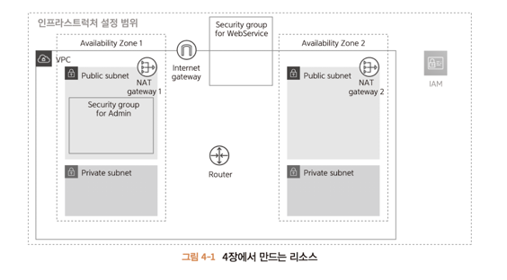
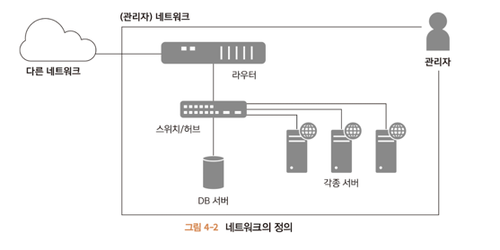

>책에서 말하는 네트워크란 인프라스트럭처 관리자가 주체가 되어 관리하는 장소이다.
> 
> 위 그림처럼 다양한 서버, 기기 그리고 케이블을 네트워크 관리자가 제공한다.
> 
> 네트워크 안에서는 자유롭게 서로 통신할 수 있다. 이런 네트워크를 **LAN(local area network)** 이라고 한다.

---
# 4.2 VPC
## 4.2.1 VPC란?
**VPC(Virtual Private Cloud)** 란 AWS 데이터센터에 있는 기기에서 서버나 네트워크 장비가 가진 기능을 에뮬레이션하는 소프트웨어를 사용하여 

서비스를 제공하는 환경을 말한다.

따라서 기기 추가나 삭제를 소프트웨어 실행이나 정지처럼 간단하게 수행할 수 있다. VPC끼리는 독립적이므로 서로 영향을 미치지 않는다.

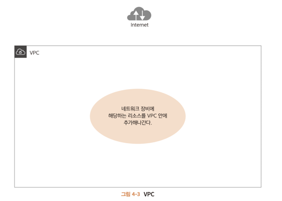

## 4.2.2 생성 내용
VPC를 생성할 때는 네트워크 정보를 결정해야 한다.

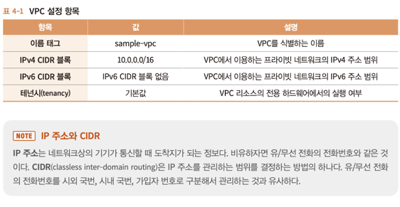

* **이름 태그**
  * 이름 태그는 VPC를 쉽게 식별하고자 붙인 이름이다. 나중에 변경 가능하다.
* **IPv4 CIDR 블록**
  * VPC에서 사용하는 프라이빗 네트워크용 IP 주소의 범위를 지정한다. 아래 세 개 중에 지정 가능하다.
    * 24비트 블록 : 10.0.0 ~ 10.255.255.255
    * 20비트 블록 : 172.16.0.0. ~ 172.31.255.255
    * 16비트 블록 : 192.168.0.0 ~ 192.168.255.255
  * 일반적으로 IP 주소의 범위가 넓은 편이 같은 네트워크 안에 많은 IP 주로를 제공할 수 있지만 VPC로 지정할 수 있는 서브넷 마스크는 최대 16비트까지이므로
  * 무엇을 선택하든 달라지는 것은 없고 편하게 고르면 된다.
  * 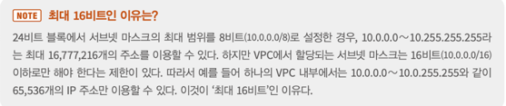
* **IPv6 CIDR 블록**
  * VPC에서 IPv6의 이용 여부를 지정하는데 특별한 의도가 없으면 '없음'을 선택한다.
* **테넌시**
  * VPC상의 리소스를 전용 하드웨에에서 실행할지 지정한다. 기본으로 설정하면 다른 계정과 하드웨어 리소스를 공유하는 것과 같다.
  * 신뢰성이 매우 중요하면 전용으로 설정하고 돈을 지불한다.
  
---
## 4.2.3 VPC 생성 순서
1. 생성

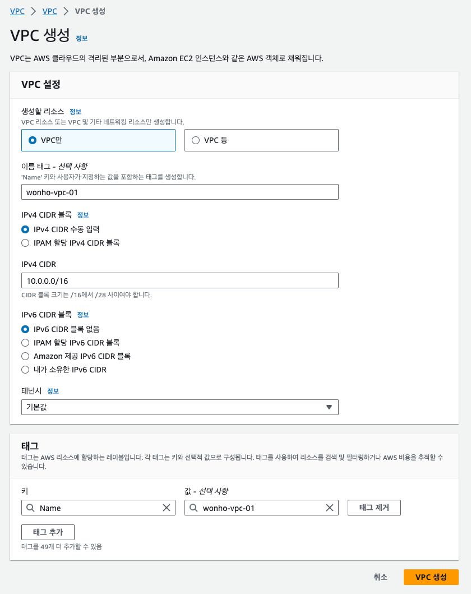

---

# 4.3 서브넷과 가용 영역
## 4.3.1 서브넷과 가용 영역이란?
VPC 안에 하나 이상의 서브넷을 만들어야 한다.

**서브넷** 은 VPC의 IP 주소 범위를 나누는 단위이다. 왜 나눌까?
1. 역할 분리 : 외부에 공개하는 리소스 여부를 구별
2. 기기 분리 : AWS 안에서의 물리적인 다중화를 수행

>역할 분리
> > 리소스가 담당하는 역할에 따라 분리한다. 예를 들어 LB는 외부 공개가 목적이므로 외부에서 접근할 수 있어야 하고 반대로
> > 
> > DB는 VPC 내부에서만 사용을 전제하므로 외부에 공개해서는 안된다.
> 
> 기기 분리
> > 내결함성을 높이기 위해 기기를 분리한다. 내결함성이란 하드웨어 고장 등의 예측할 수 없는 사고로 인해 시스템 자체를 사용하지 못하게 하는 것을 방지하는 능력이다.
> > 
> > 서브넷으로 나눠놨어도 물리적 기기가 망가지면 여러 서브넷에 있는 동일 기기에 리소스는 사용 할 수 없다.
> >
> > VPC에는 **가용 영역** 이라는 개념이 존재하는데 이 영역이 다르면 독립성이 보장되므로 가용 영역별로 서브넷을 제공하면 여러 서브넷이 동시에 이용못하는
> >
> > 가능성을 낮출 수 있다. 4장에서는 외부/내부용 서브넷을 준비한다.
> 
> 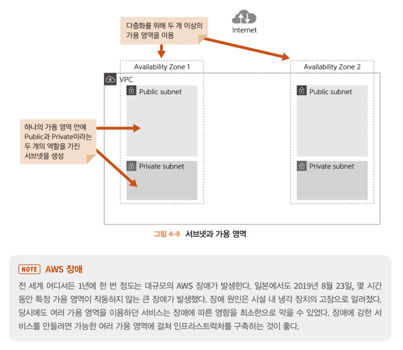

---

## 4.3.2 IPv4 CIDR 설계 방법
서브넷은 한 번 만들면 CIDR 블록을 변경할 수 없다. 따라서 두 가지를 고려해야 한다.

1. 생성할 서브넷 수
2. 서브넷 안에 생성할 리소스 수
 
이 두 항목은 트레이드오프다. 서브넷 수가 늘어나면 서브넷 안에 자원 수는 줄고, 자원 수를 늘리려면 서브넷 수가  작아야 한다.

10.0.0.0/16 이라는 CIDR 블록을 가진 VPC를 예로 보자.

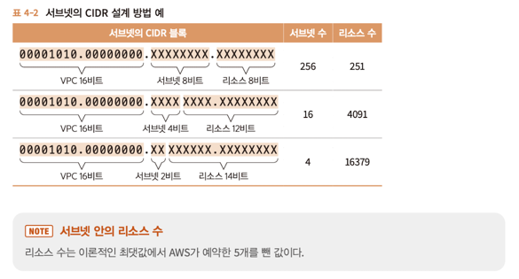

책에서는 VPC 16비트와 서브넷 4비트를 합쳐서 총 20비트를 서브넷 CIDR 블록 서브넷 마스크로 설정했다.

따라서 각각 4개의 서브넷은 아래 표와 같다.

---

## 4.3.3 생성 내용
생성할 서브넷을 확인한다. 이중화와 외부/내부 공개를 고려해 총 4개를 만든다.

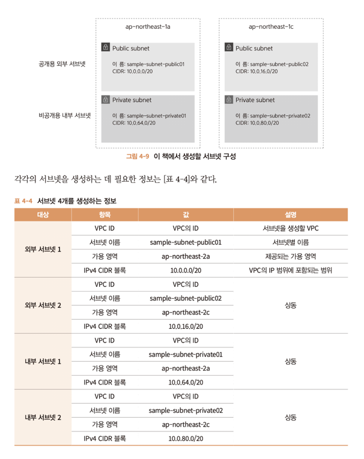

---

## 4.3.4 서브넷 생성 

---

# 4.4 인터넷 게이트웨이
## 4.4.1 인터넷 게이트웨이란?
**인터넷 게이트웨이** 란 VPC에서 생성된 네트워크와 인터넷 사이의 통신을 가능하게 하는 장치이다.

인터넷 게이트웨이가 없으면 인터넷과 VPC안에 리소스는 서로 통신할 수 없다.

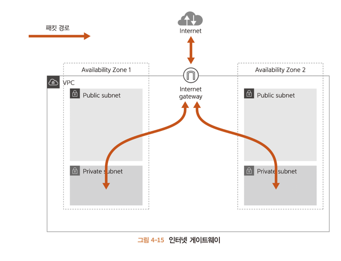

---

## 4.4.2 생성
아래 표와 같이 생성하고 VPC에 게이트웨이를 붙여서 인터넷과 통신할 수 있게 하는 것을 **연결** 이라고 한다.

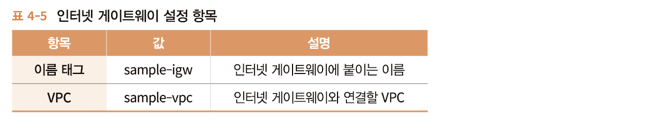

생성된 GW를 VPC에 연결한다.

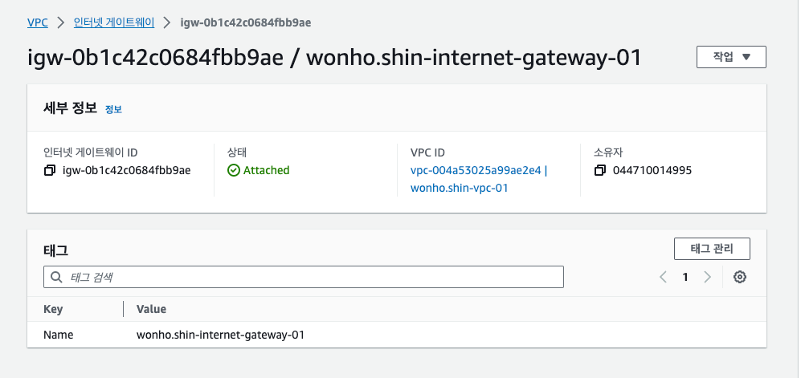

---

## 4.5 NAT 게이트웨이
### 4.5.1 NAT 게이트웨이란?

게이트웨이의 역할은 VPC에 생성된 리소스를 인터넷에 연결하는 역할이다. 직접 인터넷과 통신하므로 IP를 가져야한다.

근데 IP를 가지면 인터넷에 직접 공개되므로 public / private을 구분한 의미가 없다.

private 서브넷에 생성된 리소스는 인터넷으로 내보낼 수는 있지만 인터넷에서 직접 요청을 받으면 안된다. 

이때 **NAT(network address translation)** 를 통해 주소를 변환한다. 

AWS는 NAT를 구현하는 NAT Gateway를 제공한다.

NAT Gateway는 퍼블릭 서브넷에 대해 생성한다.

이중성 확보를 위해 2개의 가용영역을 생성하였으니 NAT Gateway도 두 곳에 생성하는게 좋은데 비싸므로 하나만 하기도 한다.

이 책에서는 양쪽에 다 붙인다.

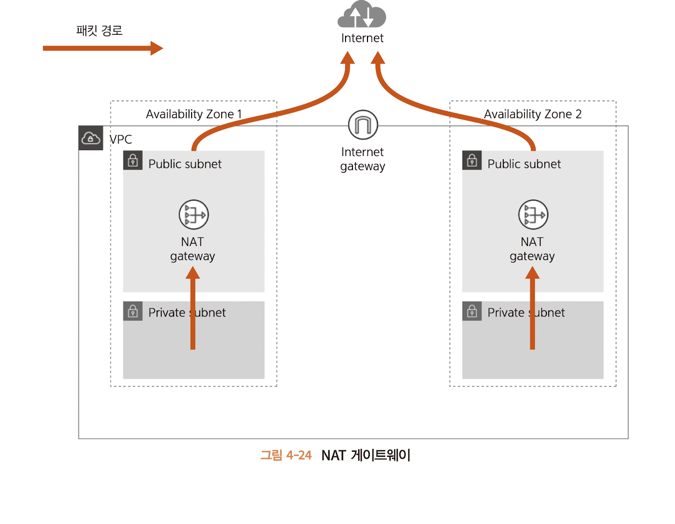

>탄력적 IP
> AWS에서는 리소스에 공개 IP를 직접 할당할 수 없다. 대신 AWS에서는 공개 IP를 관리하는 탄력적IP 기능을 제공한다.
> 
> AWS에서 탄력적 IP를 생성하면 AWS로부터 공개 IP가 할당되어 간접적으로 공개 IP를 가질 수 있도록 할 수 있다.

---

### 4.5.2 NAT 시스템

아파트에 비유하면

10층 아파트가 있고, 각 방에는 방 번호가 부여된다. 아파트 거주자들끼리는 방 번호만으로 호실을 알 수 있다. 그러나

외부에서는 방 번호 밖에 모르므로 아파트 주소를 알아야 각 호실로 편지를 보낼 수 있다.

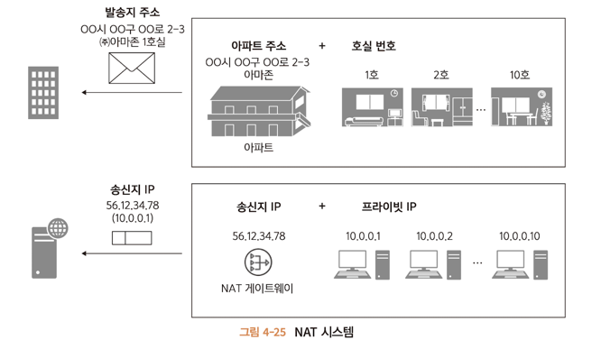

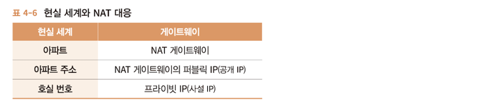

### 4.5.3 생성

아래 표에 따라 NAT 게이트웨이를 생성한다.

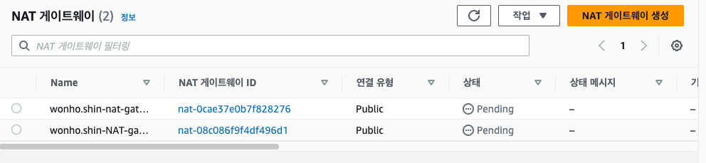

---

# 4.6 라우팅 테이블
## 4.6.1 라우팅 테이블이란?
VPC상에 서브넷을 생성하고 리소스를 생성할 장소를 준비했다.

그리고 인터넷 게이트웨이와 NAT 게이트웨이를 생성해 인터넷과 통신할 출입구도 만들었다.

하지만 아직 서브넷과 각 게이트웨이가 통신할 수 잇는 경로가 존재하지 않는다.

따라서 어떤 서브넷 안에 리소스가 해당 서브넷 밖의 리소스에 접근할 수 있는 장치가 없다.

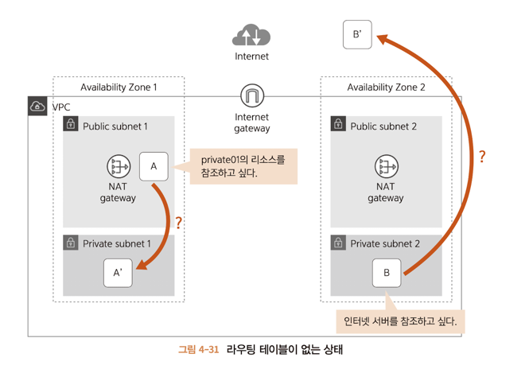

> 서브넷 사이의 통신 경로를 설정하고자 AWS에서는 **라우팅 테이블** 기능을 제공한다.
> 
> "이 서버에 접속할 때는 이 곳을 경유한다." 라는 설정을 할 수 있다.
> 
> 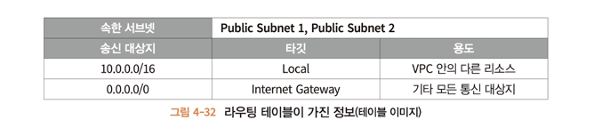
> 
> * 송신 대상지 : 접속 대상 위치에 관한 정보로 송신 대상지는 IP 주소를 지정하거나 CIDR 형식을 사용해 범위로 지정할 수도 있다.
> 
> * 타깃 : 경유지에 관한 정보이다. 라우팅 테이블에 지정할 수 있는 타킷은 몇 가지가 있는데 아래와 같다.
> > 
> > 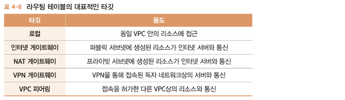

책에서는 public / private 두 가지 서브넷을 두 곳의 가용영역에 생성했다. 

총 4개의 라우팅 테이블을 작성해야 하는데 공유가 가능하므로 세 개를 생성한다.

---

### 4.6.2 생성

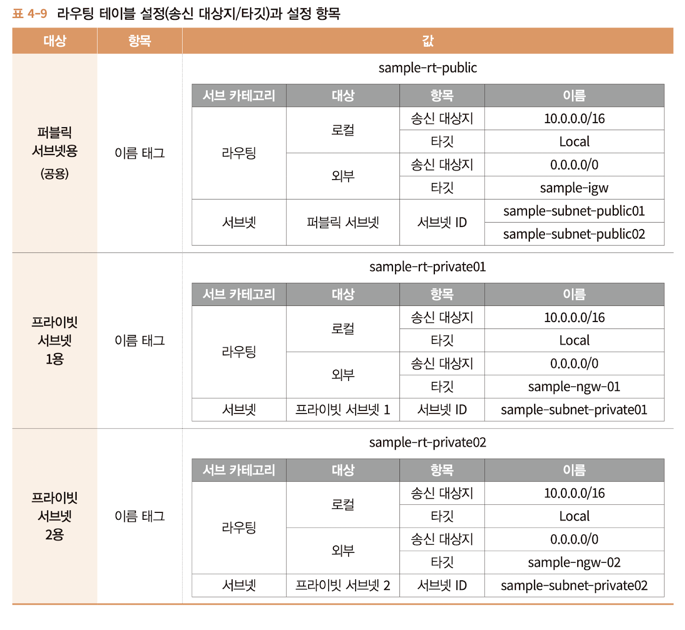

생성된 표는 아래와 같이 수행된다.

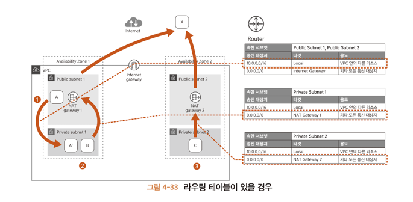Gateway

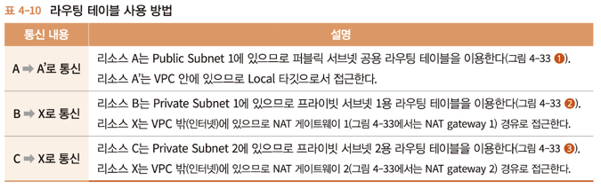

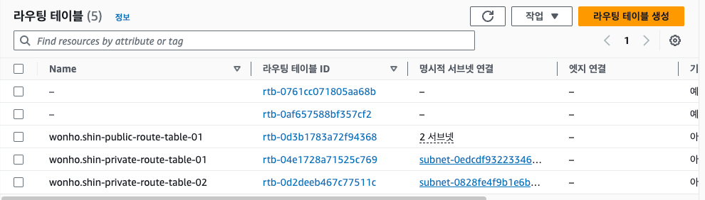

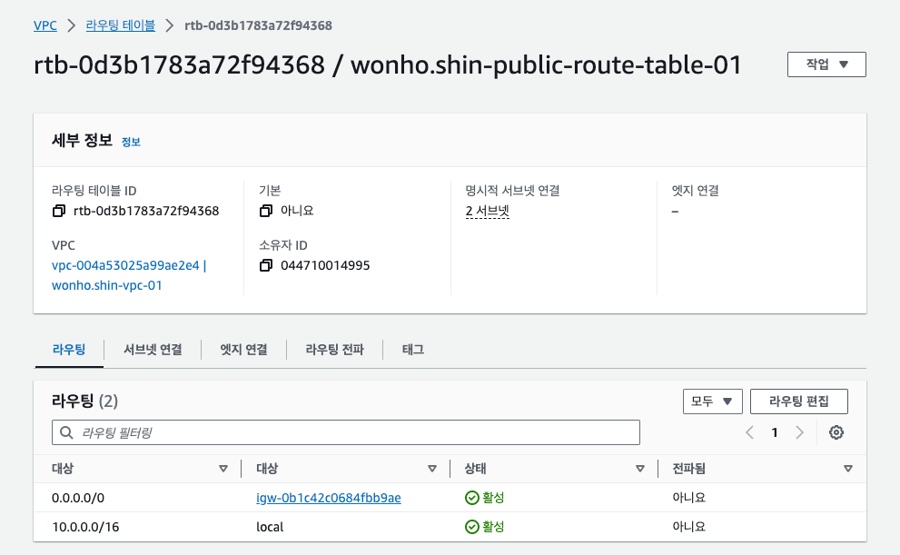

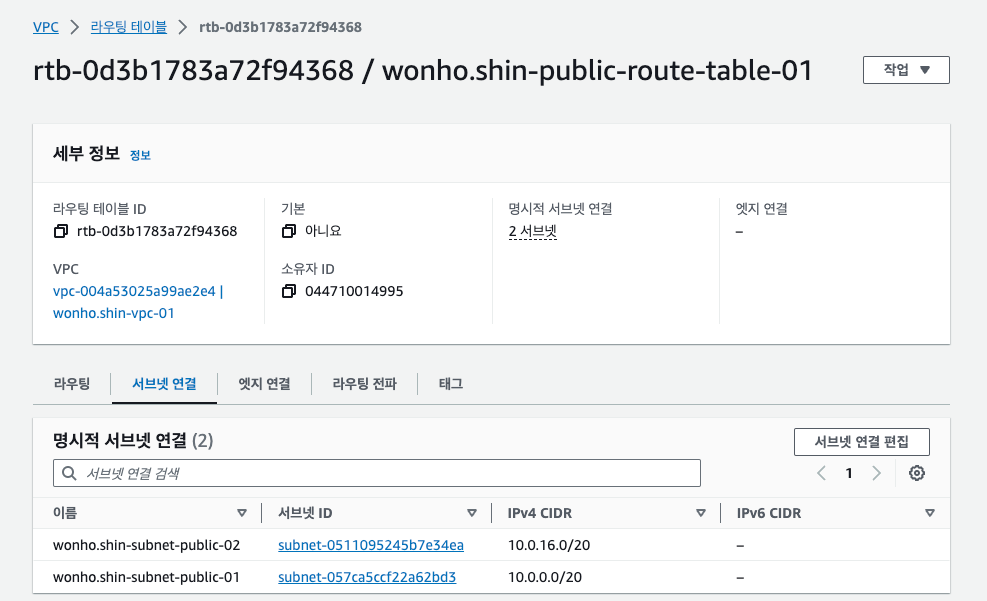

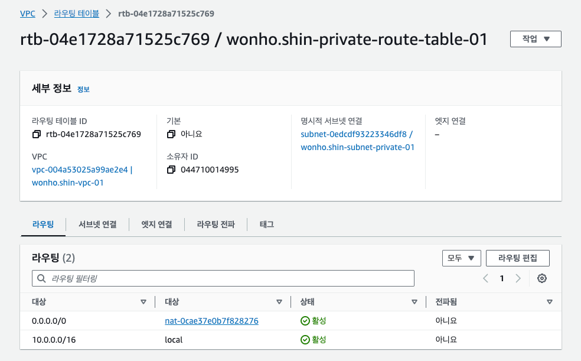

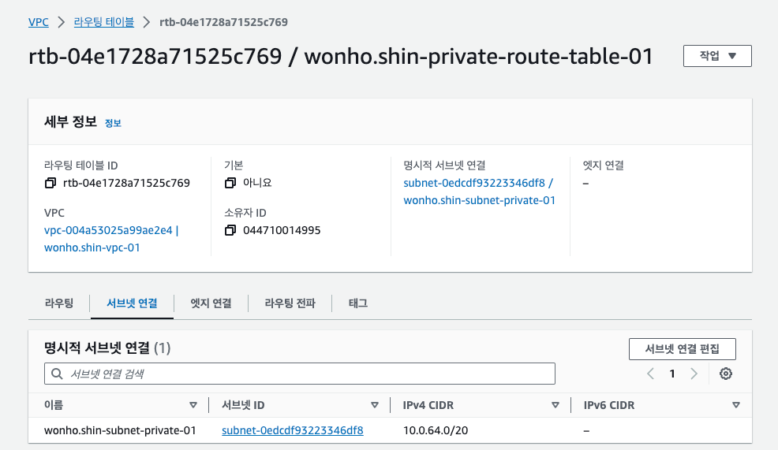

---

# 4.7 보안 그룹
## 4.7.1 보안그룹이란?
VPC상에 리소스를 생성할 준비를 마쳤다. 하지만 이대로라면 인터넷을 통해 모든 리소스에 접근할 수 있다.

VPC안의 리소스를 보호하려면 외부로부터 접근에 제한을 걸어야 한다.

이런 접근 제한을 수행하기 위해 **보안그룹** 이라는 기능을 제공한다.

> **ACL(Access Control List)** 
> > 같은 용도로 네트워크 엑세스 컨트롤 리스트 라는 기능도 있다. 이 기능을 구분해 사용하면 보안 설정을 간소화 할 수 있다.

보안 그룹에서는 우래 두 가지 개념으로 외부로부터 접근을 막을 수 있다.

1. 포트번호
2. IP 주소

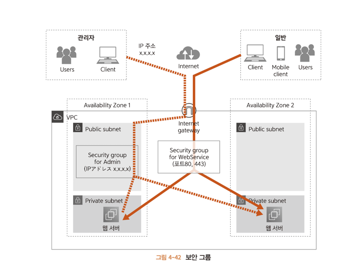

> 포트 번호를 이용한 제어에서는 제공하는 서비스의 종류를 지정할 수 있다.
> 
>예를 들어 80(http)과 443(https), 또는 서버에 접속해서 유지 보수할 떄 쓰이는 22번 (SSH) 등을 많이 지정한다.
> 
> IP 주소를 이용한 제어에서는 접속원을 지정할 수 있다.

## 4.7.2 생성
책에서는 두 가지 보안 그룹이 필요하다.
1. 모든 리소스에 접속하는 입구인 '점프 서버'
2. 요청이나 처리를 분산하는 '로드 벨런서'

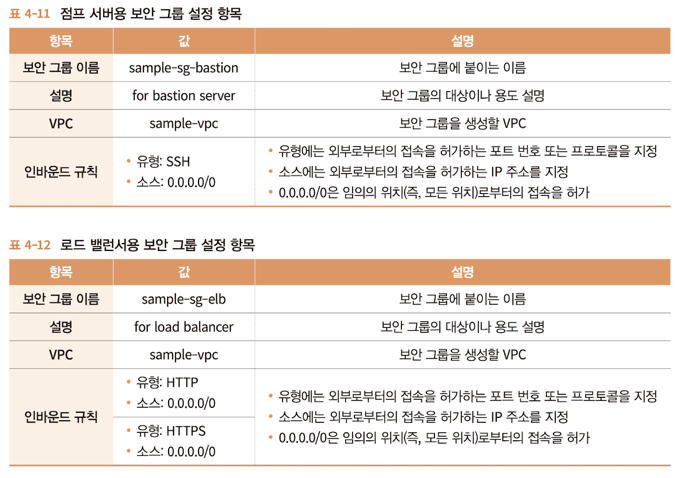

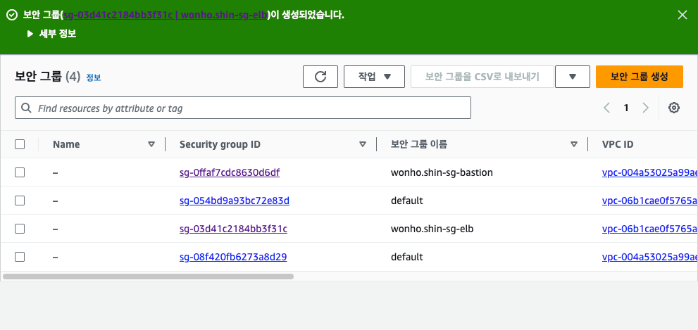

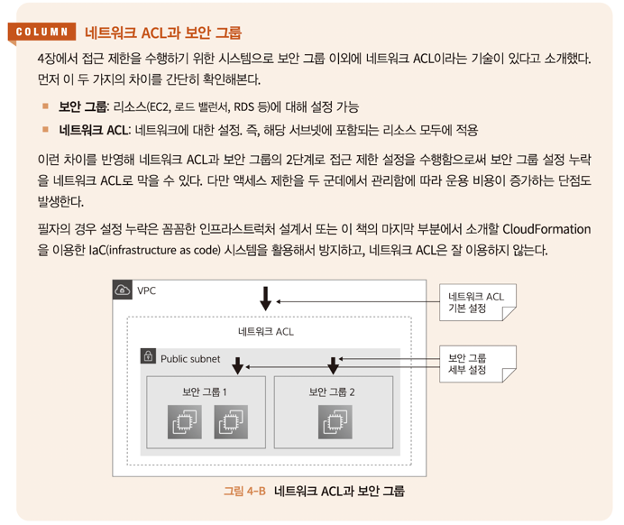

