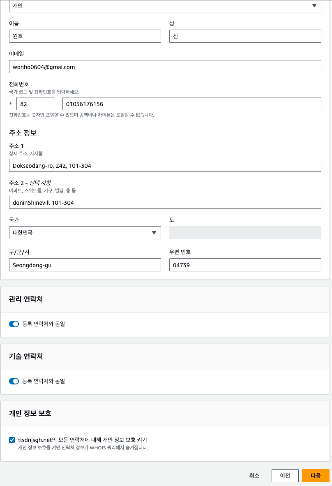
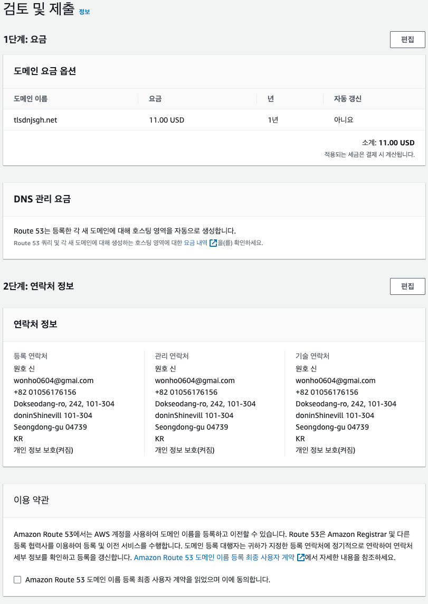
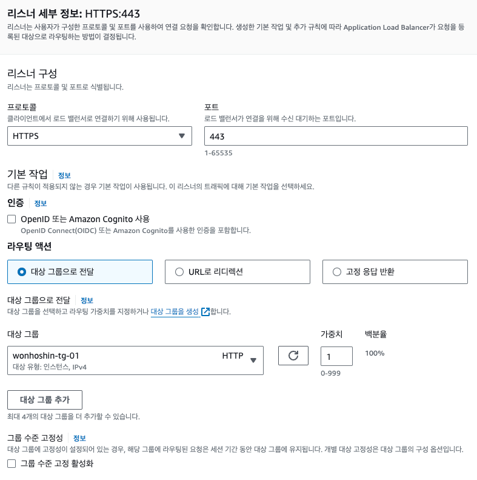

# 커스텀 도메인과 DNS 준비하기
웹에서 애플리케이션을 공개하려면 도메인이 필요하다.

알기 쉽고 기억하기 쉬운 도메인은 웹 서비스를 확산하는데 중요하다.

---

## 10.1 도메인 이름이란?
인터넷에는 수 많은 서버가 연결되어 있고, 각 서버를 식별하기 위해 IP 주소를 이용한다.

하지만 숫자의 나열로 표시되어 사람이 이해하기 쉽게 문자로 표현하는 것이 **도메인 이름** 이다.

도메인 이름은 주소처럼 계층 시스템을 사용하며 중복되지 않는 시스템이다.

한국의 주소 표기와는 다르게 좁은 범위에서 넓은 범위로 나열된다.

---

### 10.1.1 DNS
도메인 이름에서 IP 주소를 결정하는 것을 **이름결정** 이라고 한다.

이름 결정은 **DNS(Domain Name System)** 에서 제공한다.

DNS는 도메인 이름을 도메인 계층에 맞춰 분해해서 관리하여 도메인별로 DNS 서버가 제공된다.

하지만 어느 DNS 서버에 질의하더라도 전 세계의 모든 도메인 이름을 IP주소로 변환할 수 있고 아래 시스템에 따른다.

1. DNS 서버가 관리하는 도메인이면 존재하는 IP주소를 관리한다.
2. DNS 서버가 관리하는 도메인의 서브 도메인이면, 서브 도메인을 관리하는 DNS 서버에 질의한다.
3. 그 이외의 도메인이면 자신이소속된 상위 DNS 서버에 질의한다.

>예를들어 jpub.co.kr을 관리하는 DNS 서버에 b.jpub.co.kr이라는 도메인 이름에 대한 IP 주소의 이름 결정을 질의해본다.
> 
> DNS 서버는 b.jpub.co.kr이 관리 아래 있으므로 222.222.222.222라는 IP 주소를 반환할 수 있다.
> 
> 

> 이번에는 같은 DNS 서버에 google.co.kr 이라는 도메인 이름에 대한 IP 주소의 이름 결정을 질의해 본다.
> 
> DNS 서버는 이 도메인을 관리하지 않는다. 그리고 질의한 도메인 이름은 xxx.jpub.co.kr 이라는 서브 도메인을 갖지 않는다.
> 
> 따라서 .co.kr을 관리하는 상위 DNS 서버로 질의하고 .co.kr을 관리하는 도메인은 .google.co.kr 도메인을 관리하는
> 
> 바로 아래의 DNS 서버에 이름을 질의하며 이 DNS 서버가 google.co.kr 이라는 도메인 이름에 대한 IP 주소를 반환한다.
> 
> 
> 
> > 도메인 이름과 IP 주소는 반드시 1:1 관계는 아니다. 도메인 이름이 여러 IP 주소에 대응하거나, IP 주소 하나에 여러 도메인 이름이
> > 대응하기도 한다.

---
### 10.1.2 SSL 서버 인증서
브라우저로 웹사이트를 열람할 때는 통신을 수행하는 프로토콜로 HTTP 나 HTTPS를 이용한다.

> 큰 차이점은 브라우저와 웹 서버 사이에서 통신이 수행되는 방법이다.
> 1. HTTP  : 암호화되지 않은 상태
> 2. HTTPS : 암호화된 상태

브러우저 -> 웹 서버로 보내진 암호화된 데이터는 사이트 운영자가 가진 **비밀 키** 를 이용해 원래 데이터로 되돌릴 수 있다.

운영자 외에 악의를 가진 누군가가 운영자로 위장한 (피싱) 사이트를 구축해 데이터를 훔칠 가능성도 있다.

따라서 위장하지 않았음을 보장하는 회사들이 있다. 이 회사들을 **인증 기관** 이라고 부른다.

그리고 이 보장을 증명하는 것이 **SSL 서버 인증서(인증서)** 이다.

SSL 서버 인증서는 아래와 같이 운용한다.

> 1. 운영자는 인증 기관에 사이트 도메인을 증명하는 인증서 발급을 요청한다.
> 2. 인증 기관은 운영자에게 SSL 서버 인증서를 발행한다.
> 3. 사이트를 열람한 사람은 이 인증서를 브라우저로 확인할 수 있다.

대부분의 브라우저에서는 주소 창에서 열쇠 아이콘을 제공하며 SSL 서버 인증서를 확인할 수 있다.

인증 기관을 운영하는 회사는 요청을 받은 회사에서 보낸, 절대 누출되어서는 안 되는 중요한 데이터를 관리해야 한다.

따라서 신뢰가능한 인증 기관 수는 한정되어 있으며, 대부분의 경우 SSL서버 인증서를 발행하는 비용은 유료이다.

---

## 10.2 Route53의 기능 알아보기
AWS에서는 DNS의 역할을 하는 네이티브 서비스를 제공한다.

Route53은 아래 두 가지 기능을 제공한다.

>1. 도메인 이름 등록
>2. DNS 서버

---

### 10.2.1 도메인 이름 등록
**도메인 이름 등록** 이란 상위 도메인을 관리하는 조직에 자신의 도메인을 요청해서 등록하는 것을 말한다.

예를 들어 jpub.co.kr 이라는 도메인 이름을 등록하고 싶으면, 상위 도메인인 .co.kr을 관리하는 조직에 요청을 보내고 승인되면 취득할 수 있다.

도메인 획득을 대행하는 회사는 전 세계에 몇 개 정도 존재하며, Route53을 이용하면 이를 대행해준다.

---

### 10.2.2 DNS 서버
Route53은 DNS 서버의 기능을 제공하는 매니지드 서비스이다.

Route53을 이용하지 않고 EC2 인스턴스를 이용해 오픈 소스 DNS 서버를 구축할 수도 있지만

안정성, 비용, 성능, LB와이 연계 등의 장점이 있으므로 사용하는게 좋다.

Route53에서는 두 가지 유형으로 DNS 서버를 생성할 수 있다.

> 1. 퍼블릭DNS   : 외부에 공개하는 DNS
> 2. 브라이빗DNS : 외부에 공개하지 않는 DNS
> > 퍼블릭 DNS 라는 용어는 공식 용어가 아니지만, 책에서는 대비를 위해 사용한다.

---

#### 퍼블릭 DNS
인터넷을 경유하는 외부로부터의 통신에 대해 퍼블릭하게 공개하는 서버의 도메인 이름을 결정하는데 쓰인다.

예를 들어, 웹 서버나 LB등을 공개할 때 이용되는 서버이다.

퍼블릭 DNS는 이름 결정에 따라 **퍼블릭IP** 를 반환한다.

---

### 프라이빗 DNS
시스템 내부에 생성한 리소스에 이름을 붙여 관리할 때 쓰인다.

예를 들어, DB 서버나 시스템 내부에서만 참조되는 것을 전제로 한다.

이름 결정에 따라 **프라이빗IP** 를 반환한다.

---

## 10.3 Certificate Manager
AWS는 SSL 서버 인증을 발행할 수 있는 인증 기관의 기능을 가진다.

AWS에서 구축하는 사이트에서 이용하는 SSL 서버 인증서를 무료로 발급할 수 있다.

SSL 서버 인증서는 인증 대상 레벨에 따라 크게 3개의 유형으로 나뉜다.

> 1. 도메인 검증 완료(DV) 인증서 : 도메인 이름이 올바름을 보증한다.
> 2. 조직 검증 완료(OV) 인증서 : 도메인 이름의 올바름과 함께, 도메인을 관리하는 회사명을 보증한다.
> 3. 확장 인증(EV) 인증서 : 도메인을 관리하는 회사의 실제 존재 여부와 신뢰성까지 보증한다.

아래로 갈수록 신뢰성으 높아지지만 비용도 늘어난다.

AWS의 route53의 경우 DV인증서에만 대응한다.

---

## 10.4 도메인 이름 취득하기

AWS에서 도메인 이름을 취득하면 자동으로 Route53에 퍼블릭 DNS도 생성된다.

---

### 10.4.1 도메인 이름 취득 순서
도메인 이름을 얻어보자. AWS 콘솔에서 Route53 데시보드를 들어가, '등록된 도메인' > '도메인 등록' 버튼을 클릭한다.

---

#### 도메인 검색
도메인 이름을 입력한다. 기본적으로 '고유명칭 + 탑 레벨 도메인' 과 같이 조합한다. 탑 레벨 도메인은 예를 들면 .com이나 .co.kr 등

개별 도메인을 할당하기 위해 관리되는 상위 도메인이다.

아직 사용되지 않은 도메인이면 장바구니에 넣고 저장하면 된다.

'관련 도메인 제안' 은 비지니스를 위해 비슷한 도메인을 취득하는 경우에 사용되는데 책에서는 사용하지 않는다.

---

#### 연락처 세부 정보
도메인에 대한 연락처 세부 정보를 입력한다. 개인의 경우에는 모두 동일하지만, 기업의 경우 다를 수 있다.

1. 연락처 유형 : 도메인 취득이 개인인지 법인인지 선택한다. 연결한 등록지는 퍼블릭 정보로 누구나 참조할 수 있다.
   2. 개인을 선택하면 입력한 내용은 이후 비공개로 설정 가능하다.
3. 이름, 성 : 이름이나 주소 등을 등록한다.
4. 브라이버시 보호 : 도메인 취득자로 개인을 선택했다면 프라이버시 보호를 설정하고 활성화하면 원래는 공개되는 연락처 정보가 비공개된다.

#### 확인 및 구매

도메인 자동 갱신 여부는 추후 설정 가능하다.

---

## 10.5 퍼블릭 DNS에 리소스 정보 추가하기
Route53을 통해 도메인 이름을 취득하면, 자동 취득된 도메인을 관리하는 퍼블릭 DNS가 자동으로 생성된다.

생성된 DNS에 외부로부터 접근되는 다음 리소스 정보를 추가한다.

> 1. 점프 서버
> 2. 로드 벨런서

### 10.5.1 퍼블릭 DNS롱의 추가 순서
DNS 서버나 LB등의 정보를 추가할 때는 DNS 레코드 셋을 편집한다.

---

#### 점프 서버 정보 추가

점프 서버에는 퍼블릭 IP가 할당되어 있으므로 그대로 IP 주소를 등록하고 '호스팅 영역 세부 정보' 에서 '레코드 생성' 버튼을 클릭한다.

----

##### 단계 1 : 라우팅 정책 선택

단순 라우팅을 선택한다.

---

#### 단계 2 : 레코드 설정
'단순 레코드 정의' 버튼을 클릭한다.

> 1. 레코드 이름 : 미리 정해둔 이름 (bastion) 으로 입력한다.
> 2. 레코드 유형 : A-IPv4 주소 및 일부 aws 리소스로 라우팅 을 클릭한다.
> 3. 값/트래픽 라우팅 대상 : EC2 인스턴스에 할당된 IP 주소를 지정한다.
>    4. 점프 서버의 퍼블릭 IP주소를 등록한다.

---

##### 로드 벨런서 정보 추가
LB 정보를 퍼블릭 DNS에추가 한다.

다시 한 번 DNS에 단순 레코드를 정의 한다.

>1. 레코드 이름 : www를 입력한다.
>2. 레코드 유형 : IPv4 및 일부 aws 리소스로 트래픽 라우팅 을 선택한다.
>3. 값/트래픽 라우팅 대상 : Application/LB에 대한 별칭을 선택한다.

---

### 10.5.2 작동 확인
~~~java
nslookup 명령을 이용하여 도메인 이름이 올바르게 IP 주소로 변환되는가를 확인한다.
~~~

----

#### 로드 벨런서
LB도 확인해본다.

하나의 도메인 이름에 대해 여러 UP 주소가 존재하는 상태는 많은 요청을 처리하는 LB같은 시스템에서 많이 쓰인다.

요청이 늘어날때마다 IP를 늘리면 마치 창구를 늘릴 때와 같은 느낌으로처리 능력을 향상 시킬 수 있다.

----

#### 도메인 이름으로 접속하기
점프 서버(bastion)에 도메인 이름을 붙였으므로 SSH config 파일을 수정해본다.

~~~
host i-* mi-*
  ProxyCommand sh -c "aws ssm start-session --target %h --document-name AWS-StartSSHSession --parameters 'portNumber=%p'"
  User ssh-user
  IdentityFile ~/musinsa/00.utils/bastion.manage.seoul.pem

Host bastion
	Hostname bastion.tlsdnjsgh.net
	User ec2-user
	IdentityFile /Users/shin-wonho/.ssh/wonho.shin.pem

Host web01
    Hostname 10.0.64.229
    User ec2-user
    IdentityFile /Users/shin-wonho/.ssh/wonho.shin.pem
    ProxyCommand ssh bastion -W %h:%p

Host web02
	Hostname 10.0.86.129
	User ec2-user
	IdentityFile /Users/shin-wonho/.ssh/wonho.shin.pem
	ProxyCommand ssh bastion -W %h:%p
~~~

---

## 10.6 프라이빗 DNS 준비하기
이제 프라이빗 차례다..

### 10.6.1 생성 내용

프라이빗 DNS를 설정함으로써 VPC 내부의 서버를참조할 때 프라이빗 IP주소나 기계적인 도메인 이름이 아닌

알기 쉬운 이름으로 설정할 수 있다. VPC 안에 리소스는 가능하면 private DNS에 등록한다.

> 프라이빗 DNS에서 이용하는 도메인 이름은 전 세계에 존재하는 퍼블릭 도메인과 이름이 중복되지 않아야 한다.
> 
> 예를 들어 도메인 이름에 jpub.co.kr 이라는 이름을 붙였다고 가정할때 VPC 내부에서 도메인 이름을 등록해 사용한다면
> 
> 원래는 jpub.co.kr을 관리하는 외부 DNS 서버에 질의해야 하지만 생성한 프라이빗 DNS에 질의를 던져 의도치 않은 IP를 받을 수도 있다.
> 
> 현 시점에 중복되지 않는 도메인 이름은 아래가 있다.
> 1. corp
> 2. home
> 3. mail
> 4. internal
>
> 이런 도메인, 서브 도메인을 이용하는데 internal은 aws가 내부적으로 사용해서 안 쓰는 것이 좋다.

프라이빗 DNS는 하나의 VPC 안에서만 이용할 수 있다. 여러 VPC에 걸쳐 포괄적인사용은 불가능 하다.

---

### 10.6.2 프라이빗 DNS 생성 순서

#### 프라이빗 DNS 이용 가능 여부 확인
우선 VPC에서 프라이빗 DNS를 사용 가능한지 확인해 본다.

VPC 대시보드 > VPC 클릭 > 세부 정보 에 다음 2개가 활성화 된지 확인한다.
1. DNS 결정
2. DNS 호스트 이름

비활성화 되어있다면 설정을 변경한다.

---

#### 호스트 영역 생성
Route53 대시보드 > 호스팅 영역 > 호스팅 영역 생성

>1. 도메인 이름 : home 으로 한다.
>2. 설명 : 필수는 아니지만 입력한다.
>3. 유형 : 프라이빗 호스팅 영역을 선택한다. 이때 VPC ID를 선택한다.
>4. 리전 : ap-northeast-2 를 지정한다.
>5. VPC ID : 책에서 생성한 vpc를 선택한다.

---

### 10.6.3 EC2 정보 추가 순서
먼저 EC2의 정보에 private DNS를추가한다.

점프 서버와 2개의 웹서버 EC2를 사용하므로 3개 추가한다.

home 도메인을 선택한 후에 레코드 생성으로 생성한다.

public 과의 차이점 : 이 경우, private IP를 입력한다.

다른 web 서버 2개도 등록한다.

---

### 10.6.4 RDS 정보 추가 순서
다음으로 RDS의 정보를 프라이빗 DNS에 추가한다.

RDS에는 고정된 IP주소는 참조할 수 없도록 되어 있다.

대신 엔드포인트가 제공되므로 프라이빗 DNS에 등록한다.

#### 엔드 포인트 관리
RDS 대시보드에서 확인할 수 있다.

---

#### RDS 엔드포인트를 프라이빗DNS에 등록
route53 대시보드 > 호스팅 영역 > private dns 선택 > 레코드 생성 > 단순 레코드 정의

> 1. 레코드 이름 : db
> 2. 레코드 유형 : 엔드포인트를 지정할수 있는 'CNAME - 다른 도메인 이름과 일부 AWS 리소스로 라우팅'
> 3. 값/트래픽 라우팅 대상 : RDS 인스턴스에 할당된 IP 주소를 입력하고 여기에 RDS 엔드포인트를 기입한다.
> > 

> AWS에서 CNAME은 "Canonical Name"의 약자로, 도메인 이름을 다른 도메인 이름에 매핑하는 DNS 레코드 유형을 나타냅니다.
> 
> CNAME 레코드를 사용하면 하나의 도메인을 다른 도메인으로 "별명" 지정할 수 있습니다.

> Amazon RDS는 높은 가용성, 확장성, 백업 및 복원 기능 등을 위해 여러 가지 기술을 사용합니다.
> 
>Amazon RDS 인스턴스는 다수의 가용 영역에 걸쳐 배포될 수 있고, 필요에 따라 자동으로 스케일링될 수 있습니다.
> 
> 이러한 특성들로 인해 인스턴스에 고정된 퍼블릭 IP를 할당하는 것이 어려워지며, 유지 관리의 복잡성이 증가할 수 있습니다.

---

### 10.6.5 작동 확인
프라이빗 DNS의 작동을 확인해본다.

#### 도메인 이름 결정(웹 서버)
private DNS는 VPC 안에서만 확인할 수 있으므로 점프 서버에 연결해본다.

연결했다면 A레코드로 추가한 web.home의 이름 결정이 되었는지 확인한다.

----

#### 도메인 이름 결정(RDS)
다음으로 CNAME 레코드로 추가한 db.home의 이름 결정이 되었는지 확인한다.

----

#### 도메인 이름으로 변경
VPC 내부의 서버에도 도메인 이름을 붙였으므로 SSH의 config 설정 파일도 이름으로 수행하게 변경한다.

~~~java
Host web01
    Hostname web01.home
    User ec2-user
    IdentityFile /Users/shin-wonho/.ssh/wonho.shin.pem
    ProxyCommand ssh bastion -W %h:%p

Host web02
	Hostname web02.home
	User ec2-user
	IdentityFile /Users/shin-wonho/.ssh/wonho.shin.pem
	ProxyCommand ssh bastion -W %h:%p
~~~

---

## 10.7 SSL 서버 인증서 발행하기
마지막으로 SSL 서버 인증서를 발행한다.

취득한 SSL 서버 인증서를 이용해 HTTPS용 로드벨런서의 리스너를 생성하고 브라우저에서 HTTPS 통신이 가능한 것 을 확인한다.

### 10.7.1 SSL 서버 인증서 발행 순서
AWS 콘솔 > Certificate Manager 대시보드 > 새로운 ACM 관리형 인증서 버튼 클릭

#### 인증서 요청
인증서 요청 > 취득할 SSL 서버 인증 유형을 선택한다. (퍼블릭 인증서 요청)

---

#### 도메인 이름 추가
인증할 도메인을 지정한다. 여기서 지정하는 도메인은 실제 브라우저에서 입력하는 도메인이다.

예를 들어 tlsdnjsgh.net 을 취득하였지만 LB에 붙인 이름은 www. 가 붙은 서브도메인이 된다.

(브라우저에서 입력하는 주소는 LB의 이름을 이용하므로 www.tlsdnjsgh.net이 인증할 도메인이 된다.)

그러므로 도메인 이름 입력 필드에는 www.tlsdnjsgh.net을 지정해야 한다.

---

#### 검증 방법 선택
AWS에서 도메인 요청자를검증하는 방식이다.

대규모 인증 기관에서는 종이 문서를 이용하기도하지만, AWS에서는 DNS검증과 이메일 검증 중 하나의 방법으로 검증이 가능하고

Route53에서 DNS를 생성했을 때는 전자인 DNS 검증이 더 간단하다.

다음으로 도메인을 검증한다. 인증서를 클릭하고 도메인 카테고리에서 Route53에서 레코드 생성 버튼을 클릭한다.

---

### 10.7.2 로드 벨런서에 리스너 추가

다음으로는 발행한 서버 인증서를 이용해 HTTPS를 받는 리스너를 로드 벨런서에 추가한다.

EC2 대시보드 > 로드벨런서 > 리스너 추가

####
> 1. protocol, port : 프로토콜과 포트는 각각 HTTPS와 443을 사용한다.
> 2. Default Action : Forward를 선택한 뒤 7장에서 생성한 타깃을 선택한다.
> 3. Security Policy: 기본 제공 정책을 사용
> 4. Default SSl Certificate : 바로 생성한 SSL 인증서를 사용

---

### 10.7.3 작동 확인
마지막으로 작동을 확인하고 브라우저에서 HTTPS로 접근할 수 있는지를 확인한다.

7장처럼 각 WEB서버에 index.html을 준비하고 실행한다.

실행 후, HTTPS로 연결한다. 단 LB에 붙인 도메인이 아닌 퍼블릭 DNS에 추가한 도메인으로 접속해야 한다.

