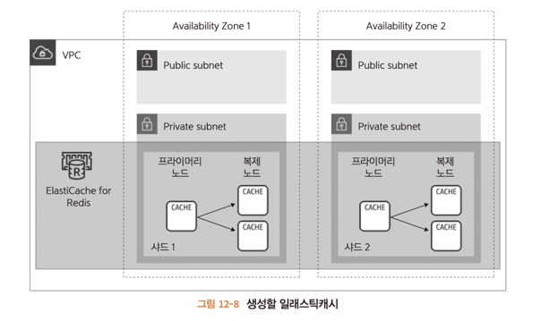

# 목차

어플리케이션 성능을 향상 시키는 방법 중 하나로 '캐시' 라는 시스테이 있다.

캐시는 웹 어플리케이션에서 널리 쓰이며, AWS에서도 캐시를 구현하는 매니지드 서비스를 제공한다.

이번 12장에서는 캐시이용 방법을 설명한다.

# 12.1 캐시 서버란?
캐시는 처리에 시간이 걸리는 결과 데이터를 저장해두고, 다음에 같은처리를 수행할 때는 저장된 결과 데이터를 사용해

결과를 빠르게 반환하는 시스템이다.

예를 들어, 복잡한 SQL을 이용한 검색이나 또는 어플리케이션 외부 서비스로의 문의 등을 얻을 수 있는 결과에서

캐시를 사용하면 속도를 높일 수 있다.

---

## 12.1.1 캐시 시스템

>1. 서버에 캐시되지 않은 상태이다.
>
>2. 시간이 걸리는 처리를 호출하고 3. 에서 데이터를 받는다.
>
>3. 이때 서버에서 데이터를 캐시로 저장하고
>
>4. 반환한다.
>

> 5. 에서 요청을 받은 시점에서는 데이터가 캐시로 남아있어서 바로 
> 6. 반환한다.

---

### 캐시 사용 시 주의점

> 시간이 걸리는 처리 결과 데이터가 캐시 데이터와 어긋날 가능성
> > 예를 들어, 현재의 날씨 정보를반환하는 서비스를 이용하는데 처리 시간이 걸린다고 가정하면
> > 
> > 처리 결과를 캐시로 저장할 경우, 캐시에 저장되는 데이터는 데이터 처리 시점의 데이터이다.
> > 
> > 날씨 정보가 1시간마다 바뀌더라도 캐시 데이터는 그만큼 자주 마뀌지 않는다. (오래된 캐시)

> 서버에 캐시 데이터 저장 영역이 필요
> > 지나치게 많은 데이터를 캐시에 저장하면 서버 자체의 부하가 높아지고 심지어 처리가 지연될 가능성이 있다.
> 

이런 점들을 고려해 캐시 데이터는 보통 유효 기간을 설정한다.

그리고 유효 기간이 지나면 그보다 오래된 데이터는 이용하지 않고 새로 데이터를 얻는다.

---

## 12.1.2 레디스와 멤케시드
캐시는 성능이 매우 중요하다. 그러므로 직접 만들지 않고 일반적으로 오픈 소스로 제공되는 캐시를 구현하는데 다음 두 가지가 유명하다.
> * 레디스
> * 멤케시드

두 가지 모두 널리 이용된다. 이책에서는 레디스를 이용한다.

~~~
레디스(Redis)와 멤케시드(Memcached)는 모두 인메모리 데이터 스토어로서, 높은 성능을 제공하는데 사용됩니다. 그러나 각각의 특징과 사용 사례에는 몇 가지 차이가 있습니다.

데이터 타입 지원:

레디스: 레디스는 다양한 데이터 타입을 지원합니다. 문자열, 해시, 리스트, 셋, 정렬된 셋, 비트맵 등 다양한 데이터 구조를 저장할 수 있습니다. 이로 인해 다양한 용도로 사용할 수 있습니다.
멤케시드: 멤케시드는 간단한 키-값 쌍을 저장하며, 데이터 타입의 다양성이 레디스에 비해 상대적으로 적습니다. 주로 캐시 용도로 사용됩니다.

데이터 보존성:
레디스: 레디스는 디스크에도 데이터를 저장할 수 있으며, 스냅샷, AOF(Append-Only File) 등을 통해 데이터의 지속성을 보장할 수 있습니다.
멤케시드: 멤케시드는 메모리에만 데이터를 저장하므로, 시스템이 재시작되거나 장애가 발생하면 데이터가 손실될 수 있습니다. 주로 성능을 우선시하는 캐싱 시나리오에서 사용됩니다.

캐시 용도:
레디스: 레디스는 캐싱 외에도 메시징, 피드백 시스템, 리더보드 등 다양한 용도로 사용됩니다.
멤케시드: 주로 캐싱에 특화되어 있어 데이터를 빠르게 읽고 쓸 수 있습니다.

클러스터링:
레디스: 레디스는 클러스터링을 지원하여 확장성을 높일 수 있습니다.
멤케시드: 멤케시드는 고가용성을 위한 클러스터링을 제공하지 않습니다. 일반적으로는 여러 인스턴스를 사용하여 부하 분산을 구현합니다.

성능 특징:
레디스: 레디스는 복잡한 데이터 구조를 다룰 수 있으며, 다양한 옵션을 제공하여 성능을 튜닝할 수 있습니다.
멤케시드: 멤케시드는 단순한 키-값 캐시 모델을 가지고 있어 빠른 읽기와 쓰기 성능을 제공합니다.
요약하자면, 레디스는 다양한 데이터 구조를 지원하고 지속성을 보장하는 데에 중점을 두며, 멤케시드는 단순하고 빠른 캐싱에 특화되어 있습니다.
 어떤 데이터 스토어를 선택할지는 사용 사례와 요구사항에 따라 다를 수 있습니다.
 
 스레드 측면에서 레디스와 멤케시드의 차이점을 살펴보겠습니다.

멀티스레딩 지원:
레디스: 레디스는 멀티스레딩을 지원하지 않습니다. 하나의 레디스 인스턴스에서는 동시에 하나의 명령만을 처리합니다. 이는 싱글 스레드 모델로 알려져 있습니다.
멤케시드: 멤케시드는 다수의 스레드에서 동시에 작업하는 멀티스레딩 환경에서도 잘 동작합니다. 
여러 스레드가 동시에 멤케시드에 접근하여 데이터를 읽고 쓸 수 있습니다.

락 및 동시성 관리:
레디스: 레디스는 싱글 스레드 모델이기 때문에 락(lock)을 사용하지 않아도 됩니다. 하지만 이로 인해 동시성이 저하될 수 있습니다.
멤케시드: 멤케시드는 멀티스레딩을 지원하므로, 동시에 여러 스레드에서 작업할 수 있습니다. 이는 고객 요청을 동시에 처리할 때 유리합니다.

스레드 안전성:
레디스: 레디스는 단일 스레드이므로 스레드 안전성에 대한 고민이 없습니다. 하지만 동시에 여러 연결이 있을 경우에 대한 고려가 필요합니다.
멤케시드: 멤케시드는 멀티스레딩 환경에서 안전하게 동작하도록 설계되었습니다. 여러 스레드가 동시에 접근하더라도 데이터 무결성을 유지할 수 있습니다.

성능 측면:
레디스: 레디스는 단일 스레드이지만 비동기적인 연산을 지원하여 I/O 바운드 작업에서도 효율적으로 동작할 수 있습니다. 
멀티코어 환경에서는 여러 레디스 인스턴스를 사용하여 성능을 향상시킬 수 있습니다.
멤케시드: 멤케시드는 멀티스레딩을 통해 동시성을 활용하여 빠른 읽기 및 쓰기 성능을 제공합니다.
스레드 측면에서는 멤케시드가 멀티스레딩을 지원하고 동시성을 높일 수 있어서 특히 동시에 많은 요청이 처리되어야 하는 상황에서 유리할 수 있습니다.
 레디스는 싱글 스레드로 동작하므로 주로 단일 작업이나 비동기 I/O 작업에 적합합니다. 선택은 사용 사례와 성능 요구 사항에 따라 달라집니다.
~~~

# 12.1 일래스틱캐시
레디스와 멤캐시드는 모두 미들웨어로 제공된다. 즉, EC2에서 생성한 서버에 설치해 서버로 작동시킬 수 있다.
하지만 그렇게 되면 DB 서버를 직접 설치했을 때와 마찬가지로 비용, 관리측면에서 문제가 발생한다.

AWS에서는 레디스 및 멤케시드와 호환되는 일래스틱캐시라는 매니지드 서비스를 제공한다.

일래스틱캐시는 레디스나 맴케시드를 이미 적용한 환경을 제공한다.

---

## 12.2.1 일래스틱캐시 계층 시스템
일리스틱캐시는 기본적으로 임의의 키에 대해캐시된 데이터를 반환하는 간단한 키/값 시스템을 제공한다.

그러나 내부적으로는 데이터양이나 유형에 따라 성능을 높이는 구성을 제공한다.

각 부분을 설명한다.

### 노드
노드는 일래스틱 캐시의 최소 단위이다. 캐시된 데이터가 실제로 저장되는 영역을 확보한다.

노드별로 캐시 엔진(레디스/멤캐시드), 시스템, 용량 등을 설정할 수 있다.

---

### 샤드
샤드는 1~6개의 노드로 구성된다. 이때 노드는 하나의 프라이머리 노드와 여러 복제 노드로 구성된다.

프라이머리 노드는 데이터 갱신과 참조를 수행한다.

복제 노드는 프라이머리 노드에 수행한 업데이트 내용이 복제되어 동일한 상태가 유지된다.

데이터 참조는 프라이머리 노드와 마찬가지로 수행된다.

데이터 갱신 시에는 복제 노드에 복사되는 시간이 걸리지만 참조 시에는 노드 숫자 만큼 성능을 향상 시킨다.

내결함성이 있어 프라이머리 장애 발생 시, 복제 노드를 계속 참조할 수 있고 복제 노드 중 하나를 프라이머리로 승격한다.

---

### 클러스터
클러스터는 여러 샤드로 구성된다. 클러스터를 이용해 일래스틱캐시를 구성하면 샤드의 내용이 공유된다.

멀티 AZ기능을 이용하면 여러 가용 영역으로 분산할 수도 있어서 한 영역에서 장애가 발생했을 때 다른 영역에서 짧은 시간 내에

페일오버를 수행한다. (장애가 발생했을 때 미리 준비한 환경으로 전환하는 시스템)

정리하면 샤드를 구성하면 단일 노드의 장애가 발생했을 때의 성능 향상이 있고,

클러스터를 구성하면 가용 영역에 장애가 발생했을 때 내결함성을 높일 수 있다.

---

# 12.3 일래스틱 캐시 생성하기
캐시 엔진으로 레디스를 사용하며, 클러스터를 활성화하고 샤드 안에 노드가 3개(프라이머리1, 복제2) 이며 멀티 AZ을 활성화 한다.

## 12.3.1 생성 내용
아래 표를 따라 생성한다.

---

## 12.3.2 일래스틱 캐시 생성 순서
ElastiCache 대시보드 > Redis > 생성

### Amazon ElastiCache 클러스터 만들기
클러스터 엔진과 위치를 선택하는데 이때 레디스, 클러스터모드 활성화에 체크한다.

### 레디스 설정

---

# 12.4 작동 확인하기

## SSH를 이용해 EC2 연결

## nc 명령어 설치
일래스틱캐시 클러스터에 연결할 때는 nc(netcat) 명령어를 이용한다.

기본 제공되어 있지 않으므로 설치한다.

~~~
sudo yum -y install nc
~~~

---

### 클러스터 연결 테스트
일래스틱 캐시 클러스터에 연결한다.

먼저 일래스틱캐시 클러스터 세부 정보를 확인한다.

그러면 엔드 포인트를 알 수 있다.

다음 접속한 웹 서버에서 nc 명령어로 엔드포인트를 입력핸다.

