웹 서비스를 공개한 후 안정적인 서비스가 계속 유지되는 것이 아니다.

급격한 이용자 증가, 데이터 양의 증가로 인한 저장공간 부족 등이 일어날 수 있어

셧다운의 가능성도 있다. 이런 상황에는 모니터링을 해야한다.

# 14.1 모니터링이란?
웹에 공개되는 서비스는 DB나 웹서버 등 다양한 리소스가 조합되어 작동된다.

하나라도 문제가 발생하면 서비스가 동작하지 않을 수 있다.

이런 상황에서 신속하기 서비스를 복구하려면 서비스의 상태를 파악해두어야 한다.

이를 **모니터링** 혹은 **시스템 모니터링** 이라고 한다.

효율적인 모니터링을 위해서 아래 목록을 고려한다.

> 집중 관리
> 
> 알림
> 
> 지속적인 정보 수집

---

## 14.1.1 집중 관리
웹 서비스를 구성하는 여러 요소를 한 곳에 집중 관리 할 수 있어야 하고

이를 **대시보드** 라고 한다. (관리 콘솔의 데시보드 화면과는 개념이 다르다.)

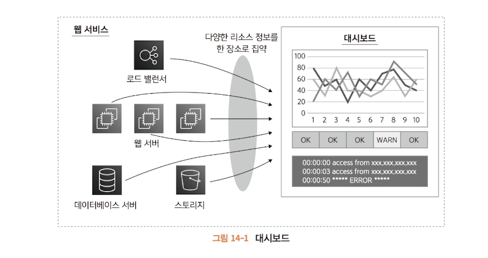

---

## 14.1.2 경보
맨날 데시보드만 쳐다볼 수 없다. 장애나 이용자 증가 등에 대한 감지가 필요하다.

이를 **경보** 또는 **얼럿** 이라고한다.

경보는 즉각적으로 알아야 하기 때문에 준 실시간으로 확인할 수 있는 시스템을 이용한다.

지연이 약간 허용된다면 메일을 사용한다.

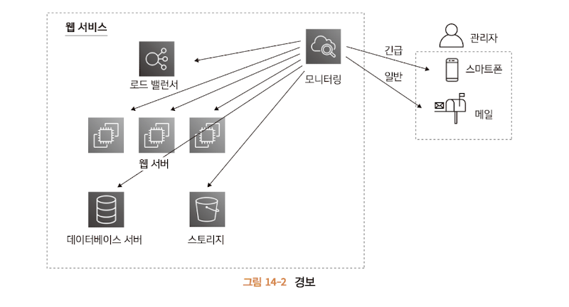

---

### 14.1.3 지속적인 정보 수집
문제가 평소에 발생했을 경우도있다. 긴 기간동안 서서히 늘어나는 부하 등을 감지하려면

평소에도 정보를 수집해야 한다.

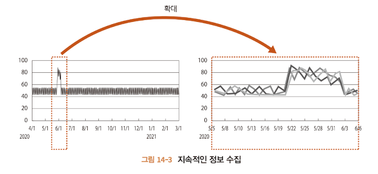

---

# 14.2 주요 모니터링 항목
서비스의 안정적이고 지속적인 서비스를 하려면 모니터링이 필요하다.

뭘 해야 할까 ?

> 생사 모니터링
> 
> CPU 사용률
> 
> 메모리 사용률
> 
> 디스크 용량
> 
> 네트워크 트래픽

---

## 14.2.1 생사 모니터링
리소스가 죽었는지 확인한다. 물리적 장애, 운영체제 오류, 네트워크 단절 등이다.

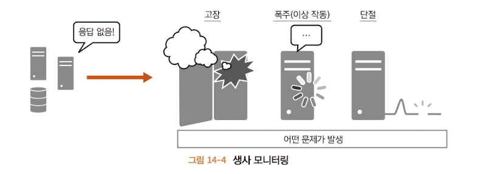

---

## 14.2.2 CPU 사용률
CPU 사용률에서는 리소스에서 과도한 작업을 하는가를 판단한다.

OS에서는 여러 처리를 동시에 할 수 있는 멀티테스크 라는 기능을 제공한다.

하지만 너무 많이 사용하려고 하면 CPU가 대기하는 시간이 늘어난다.

100%인 상태가 계속되면 실행을 기다리는 처리가 발생하는 의미다.

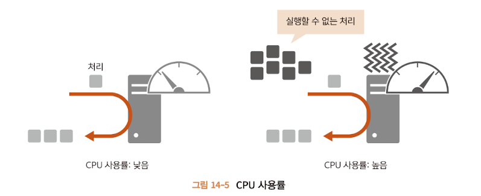

---

## 14.2.3 메모리 사용률
메모리가 많이 쓰이는가 이다.

메모리는 리소스가 처리될 때 사용되는 작업 영역이다.

마찬가지로 여유가 없으면 처리가 실행될 공간이 없어 대기가 발생한다.

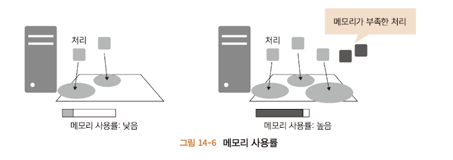

---

## 14.2.4 디스크 용량
리소스에 연결된 디스크의 빈 용량이 충분한지 확인한다.

디스크에는 프로그램이나 설정파일 등 크게 증가하지 않는 정보와

서비스에 등록되는 데이터나 로그 등 시간에 흐름에 따라 증가하는 데이터가 있다.

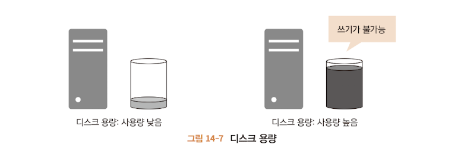

---

### 14.2.5 네트워크 트래픽
네트워크 트래픽은 네트워크를 경유해 리소스에 접근하거나, 리소스에서 나오는

통신량을 확인한다.

일반적으로 웹 서비스 등의 서비스는 네트워크를 통해 사용자의 요청을 받고 

결과를 응답한다. 그런데 리소스에 네트워크 데이터의 제한이 있다면

이용할 수 없는 상황이 된다.

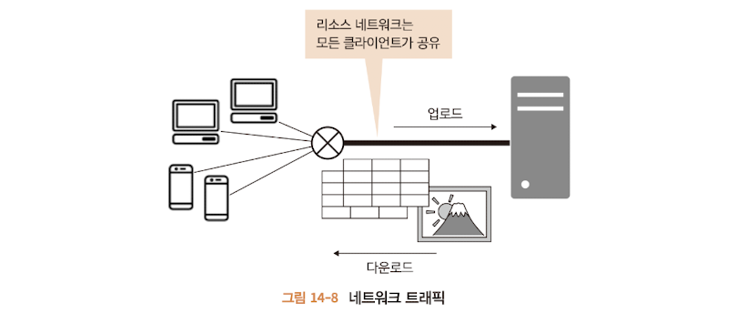

---

### 14.2.5 리소스별 모니터링 항목
아래 표와 같다.

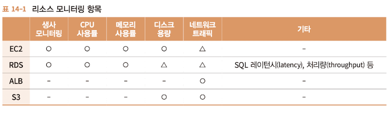

---

#### EC2
OS나 미들웨어가 원인이 되는 서버다운이 발생할 가능성이 있다.

또한 CPU, 메모리, 디스크 등에도 제한이 있으므로 사용될 가능성이 있다.

네트워크 트래픽은 EC2는 보통 직접연결하지 않으므로 크게 신경쓰지 않는다.

---

#### RDS
EC2와 거의 같다. OS나 미들웨어는 매니지드 서비스로 안정적으로 가동할 수 있다.

하지만 실제로는 보안 대응 등을 위해 재기동이 발생하므로 모니터링하는게 좋다.

그리고 RDS는 고유의 감시항목으로 실행된 SQL의 레이턴시(실행 소요 시간)과 

처리량 (throughtput)(일정 시간 당 처리량) 등을 추가한다.

---

#### ALB
ALB는 매니지드 서비스이므로 기본적으로 작동 불능이 되는 경우는 거의 없다.

하지만 통신량이 비용에 직접 반영되므로 과도한 통신이 발생하지 않는지

네트워크 트래픽은 모니터링 하는게 좋다.

---

#### S3
S3도 매니지드 서비스이므로 작동 불능이 되는 경우는 거의 없다.

하지만 디스크 사용량이나 통신량에 의해 비용이 발생하므로 디스크 용량과 

네트워크 트래픽은 모니터링 하는 것이 좋다.

> 대응책이 없으면 모니터링을 해도 의미가 없다.
> 
> 예를 들어 EC2 생사 모니터링을 수행할 때는 서버 재기동을 수행하는 대응이 필요하다.

---

# 14.3 CloudWatch
모니터링을 위한 다양한 도구가 필요하지만 이를 위해 EC2 인스턴스를 이용해야 한다.

AWS에서는 내부 리소스를 모니터링 하는 CloudWatch라는 전용 모니터링 서비스를 제공한다.

CloudWatch는 무료다. 그리고 매니지드 서비스이므로 그 자체를 모니터링 할 필요는 없고

주요 기능은 아래와 같다.

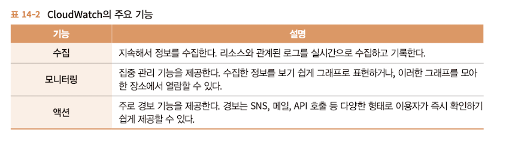

---

# 14.4 리소스 모니터링하기
CloudWatch를 이용한 모니터링 방법을 살펴본다.

## 14.4.1 모니터링 순서와 기능
아래 순서에 따라 설정한다.

1. 대시보드 생성
2. 대시보드에 위젯 추가
3. 정보 생성

### 대시보드
14.1.1 절에 소개된 것 처럼 모니터링 할 리소스 정보를 모으는 장소이다.

---

#### 위젯
대시보드에 추가할 수 있는 그래프 표시나 수치를 표시하는 유형, 텍스트를 표시하는 유형 등이 있다.

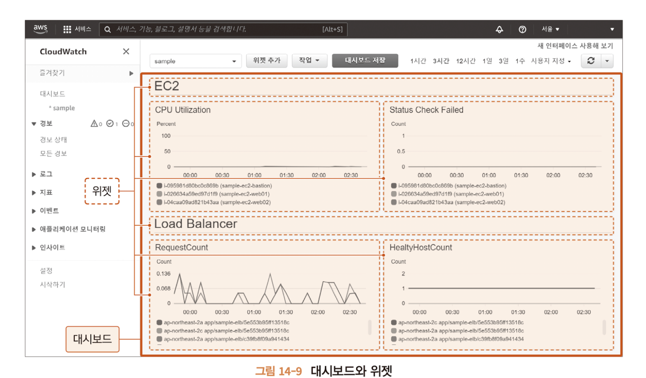

----

#### 경보
지표, 조건, 알림방법 등의 조합을 지정한다.

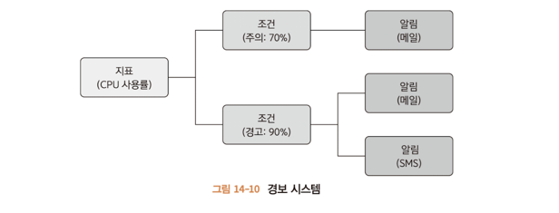

##### 지표
14.1.3 절에서 지정한 '수집할 정보' 이다.

----

##### 조건
수집한 정보를 값으로 평가하는 기준으로, 이를 만족할때 반응을 이르킨다.

예를 들어 CPU가 90% 이상 5분 지속 등의 조건을 지정할 수 있다.

조건에 따라 경보, 주의 등을 나눠서 구분할 수 있다.

----

##### 알림
지표의 조건이 만족 되었을 때 메일을 송신하거나 SMS 메세지 등을 보내거나 API 호출 등의 액션을 취할 수 있다.

하나의 조건에 대해 주의, 경고 레벨 등에 대한 액션을 구분할 수 있다.

----

## 14.4.2 대시보드 생성
해보자. CloudWatch > 대시보드 > 대시보드 생성

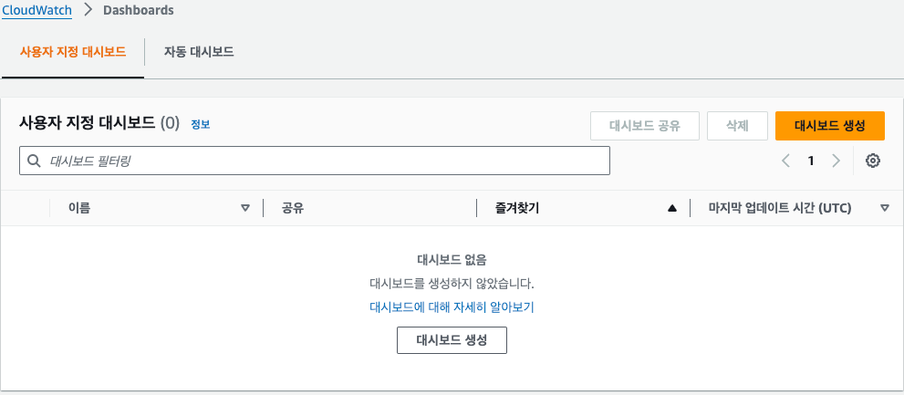

대시보드를 생성하고 위젯 추가는 스킵한다 (x 버튼을 눌러 취소)

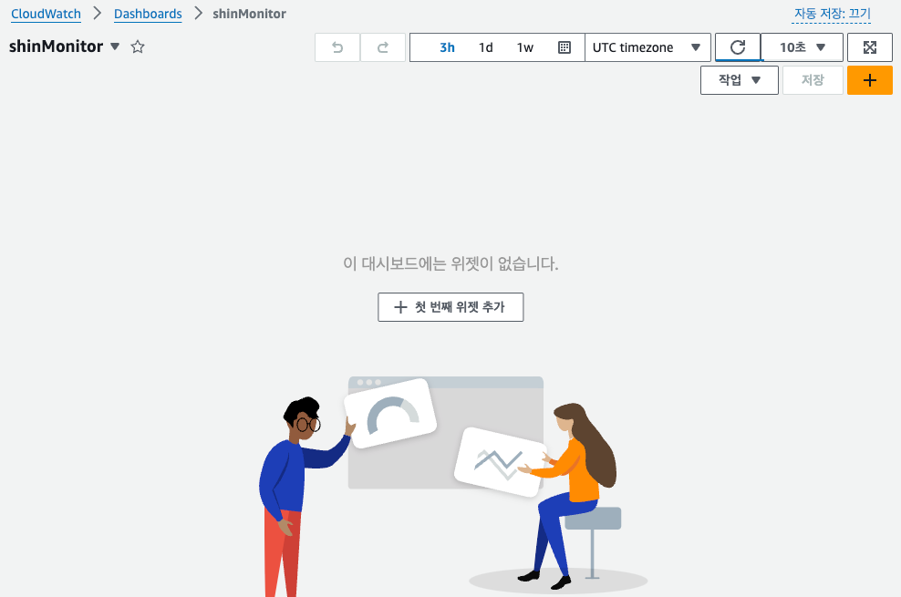

---

## 14.4.3 위젯 생성
대시보드 > 위젯 추가를 클릭

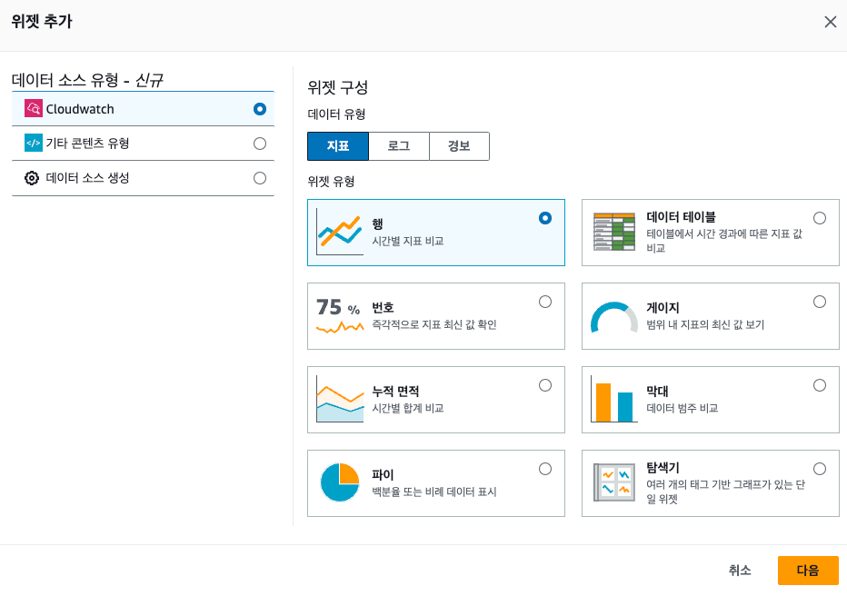

### 텍스트(라벨) 표시
텍스트를 추가해보자 텍스트 위젯은 리소스 정보가 아닌 대시보드를 쉽게 보기 위한 제목을 표시하는 기능이다.

텍스트 위젯은 마크다운으로 기술할 수 있으므로 이미지 삽입도 가능하다.

여기서는 위젯의 제목으로 #EC2 라고 입력한다.

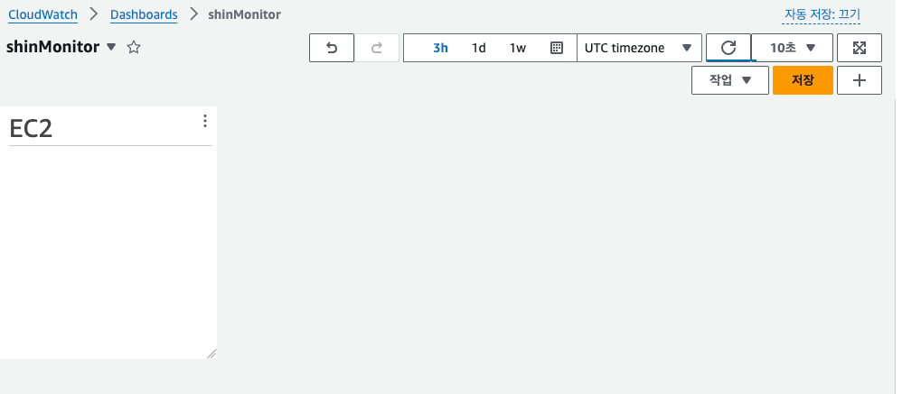

---

### EC2의 CPU 사용률 표기
다음으로 EC2의 CPU 사용률을 확인하는 위젯을 생성한다.

위젯 추가 > 다이얼로그가 표시되는 '행'을 선택한다. 이후에 위젯을 어떤 데이터 소스에서 선택할지 지정하는 옵션이 나온다.

여기에서는 '지표'를 선택한다.

#### 위젯 제목 추가
'지표 그래프 추가' 화면이 표시되므로 먼저 위젯의 제목을 설정한다. 그래프 위쪽에 편집을 클릭해서 'CPU 사용률' 이라고 제목을 변경한다.

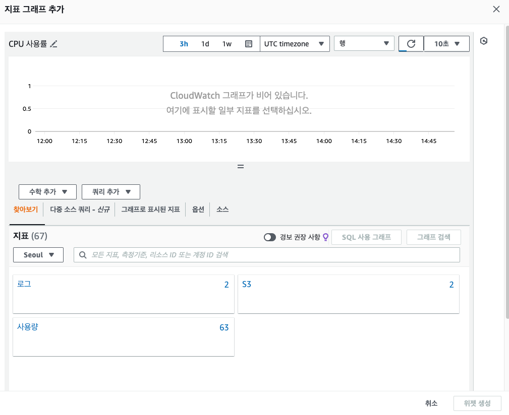

----

#### 지표 추가
화면 아래에서 '찾아보기' 탭에서 EC2 -> 인스턴스별 지표를 선택해서 CPU 사용률을 감시할 인스턴스의 CPUUtilization을 검색한 후 체크한다.

이때 여러 웹 서버에 대해 개별적으로 위젯을 만드는 것보다 한 위젯 안에 여러 웹 서버에 대한 지표를 두는 편이 보기 좋다.

---

#### 그래프 옵션 설정
위젯 > 위젯에 대해 하단에 '옵션'을 커스터 마이징 할 수 있다.

CPU 사용률은 0 ~ 100 을 갖지만 초기에서는 수집된 정보의 최소와 최대값이 Y축 범위로 이용된다.

하지만 이상태에서는 평상시 낮은 값임을 알 수 없으므로 최소 0 최대 100으로 고정한다.

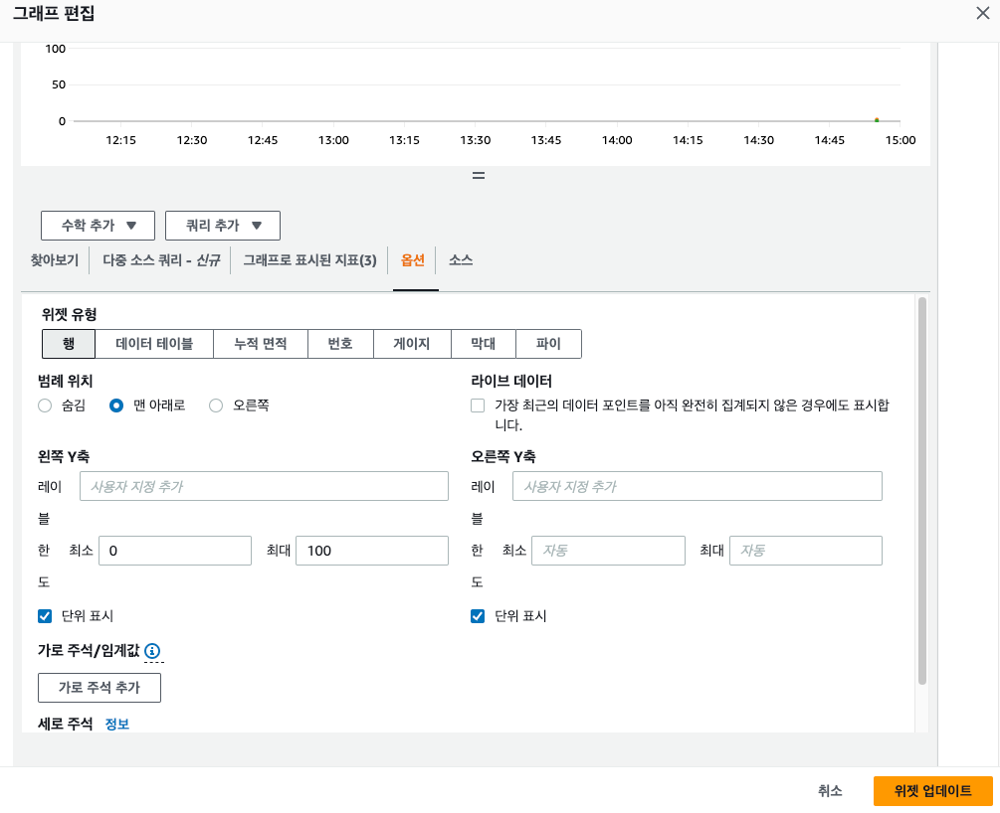

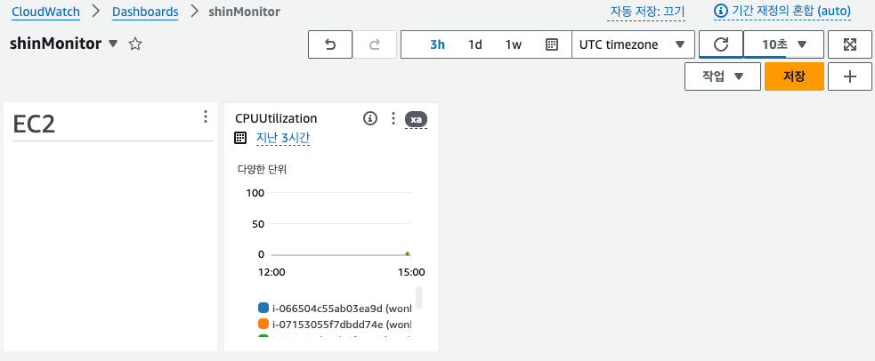

----

## 14.4.4 경보 생성
마지막으로 경보를 생성한다. 대시보드 > 경보 > 경보 상태 > 경보 생성

### 지표 선택
먼저 지표를 추가한다.

화면의 찾아보기 > EC2 > CPUUtilization을 선택한 후 CPU 사용률을 모니터링할 인스턴스를 선택한다.

----

### 조건 추가 (지표 및 조건 지정)
다음으로 조건을 추가한다.

'조건' 카테고리의 '임계값 유형'에는 '정적' 또는 '이상 탐지' 를 지정할 수 있다

> 정적 : 특정한 값 초과/미만을 지정할 수 있다.
> 
> 이상탐지 : 특정 범위 안팎을 지정할 수 있다.

CPU 사용률은 특정한 값을 초과/미만을 확인해야 하므로 여기에서는 '정적'을 선택한다.

'경보'는 정상에서 이상으로 바뀌는 경우와 그 반대 역시를 함께 생성하면 정상으로 돌아왔을 때 경보 상태도 정상으로 돌아오므로 편리하다.

이 책애세넌 CPU 사용률은 70%을 초과했을 때 이상으로 간주한다 라는 조건의 경보를 생성하는 순서를 설명하므로 '~보다' 란에

70을 입력하고 CPU 사용률이 50% 미만이면 정상으로 간주한다 라는 조건의 경보는 이 순서를 참고해서 만들어 본다.

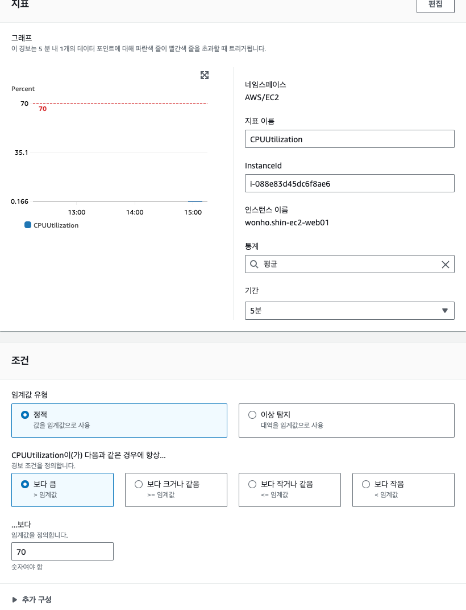

---

### 알림 생성

다음으로 알림을 생성한다.

'경보 상태 트리거' 에서 경보 상태를 설정한다. 

정상 -> 이상 전환 시 '경보 상태' / 이상 -> 정상 전환 시 '정상' 을 이용한다.

정보가 없는 경우를 대비해 '데이터 부족' 을 제공한다. 이 경우 '경보 상태'를 선택한다.

책에서는 정보와 정상 두 가지 상태를 이용한다.

'SNS 주제 선택' 에서는 알림에 이용할 SNS를 지정한다. SNS는 정보를 알리기 위해 AWS에서 제공하는 서비스이다.

미리생성해 둘 수도 있지만 '새 주제 생성' 을 선택한다.

여기서는 '알림을 수신할 이메일 엔드포인트'에 메일 주소를 입력하고 SNS 주제를 생성한다.

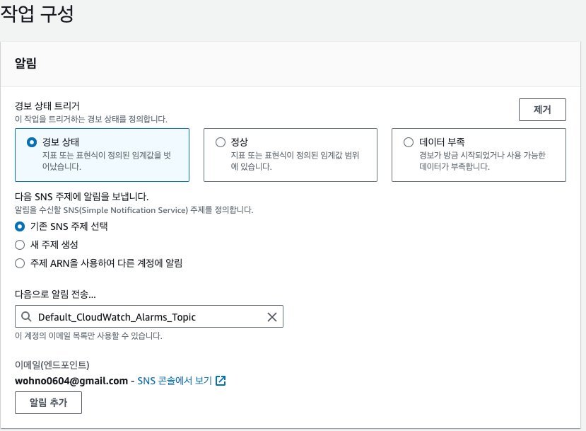

---

## 14.4.5 미리보기 및 생성
