AWS는 이용한 만큼만큼 요금을 지불하는 시스템이다.

# 15.1 요금 관리 방식
서비스 가동 전에는 **예상 비용**(견적) 을 통해 요금을 가늠할 수 있다.

서비스 가동 중에는 **PDCA** 를 통해 요금을 추정한다.

> P는 Plan (계획)
> D는 Do (실행)
> C는 Check (평가)
> A는 Act (개선)

위 네 가지 프로세스로 지속해서 요금을 개선하는 방식이다.

매월 초에 해당 월의 예산을 계획한다. 월말이 다가오면 사용된 요금을 평가하고 계산한다.

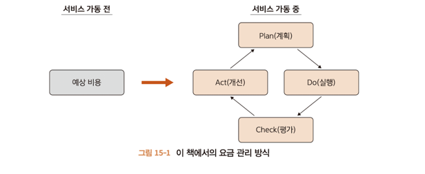

---

## 15.1.1 서비스 가동 전 견적
대략적으로 계산하면 된다. 아래 항목은 비용이 든다.

CPU / 메모리 사용 : EC2 인스턴스 / 로드벨런서 등
스토리지 사용 : S3 / 디스크
네트워크 사용 : 게이트웨ㅇ, LB 등
기타 : ElasticIP / DNS 등

---

## 15.1.2 서비스 가동 중 PDCA
월초에는 어느 정도의 요금이 들지 계획을 세운다. 이를 일반적으로 예산이라고 한다.

예산 수립 방식은 견적 낼 때와 같다. 미리 필요한 리소스를 산정한뒤 그 이용료에 단가를 곱해서 더한다.

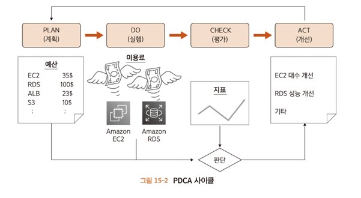

예산을 수립했다면 실행한다. 실행 중에는 매일 이용료 실적을 모니터링하고 예산과 실적이 크게 어긋나지 않는지 확인한다.

월말이 다가오면 이용료를 평가한다. 구체적으로는 예산 수립 시, 누락된 항목이 없는지 잉여나 부족이 없는지 확인한다.

마지막으로 잉여나 부족에 대한 개선을 한다.

---

# 15.2 Billing and Cost Management
견적과 예산 관련 기능을 AWS에서는 Billing and Management 라는 서비스로 제공한다.

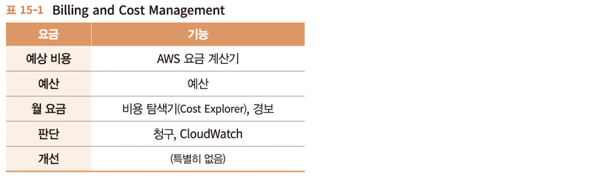

---

## 15.2.1 AWS 요금 계산기
AWS 요금 계산기는 AWS가 제공하는 예상 비용 계산 도구이다.

계정과 로그인이 필요 없이, https://calculator.aws/#/ 를 열면 실행 할 수 있는 무료 서비스이다.

위쪽 드롭다운에서 '한국어' 를 선택하고 '예상비용 생성' 버튼을 클릭한다.

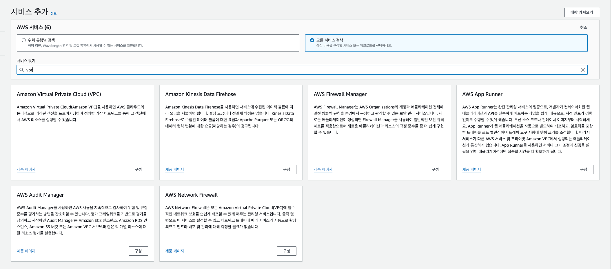

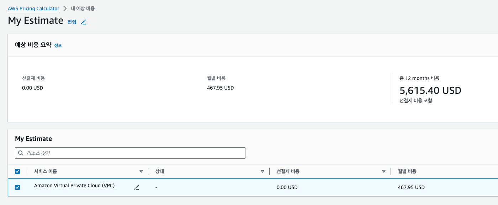

---

## 15.3 예산 작성하기
서비스를 릴리즈 했다면 PDCA를 수행한다.

먼저 Plan(계획)에 해당하는 예산 생성을 수행한다. AWS 예산은 단순히 예상액을 결정하는 것으로 끝나지 않는다.

경보를 발생 시킬 수 도있어 급격한 사용자 증가나 부정 이용 등의 가능성을 파악할 수 있다.

> 예산 생성은 IAM사용자 권한으로 실행할 수 없기 때문에 루트 사용자로 로그인 해서 진행한다.

---

### 15.3.1 예산 작성 순서
예산 대시보드는 'AWS 비용 관리' 라는 이름으로 제공된다.

AWS 관리 콘솔 화면 > 서비스 > AWS Budgets > 예산 작성을 클릭한다.

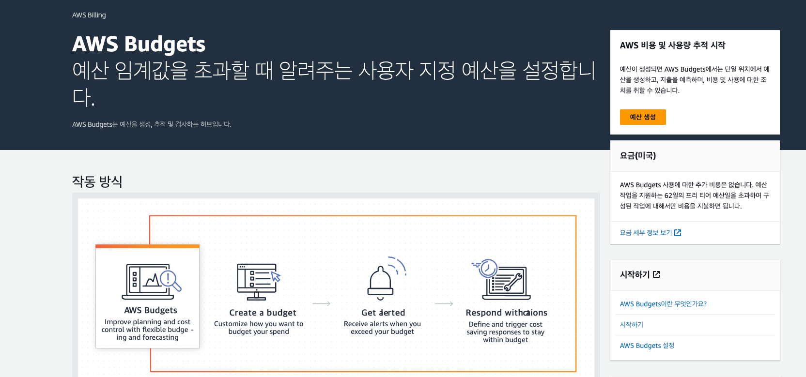

#### 예산 유형 선택
예산의 유형은 아래와 같다.

> 비용 예산 : 금액 기반 예산
> 사용량 예산 : 사용량 기반 예산
> 예약 예산 : 장기 계약에 따른 할인 관련 예산
> 절안 계획 에산 : 사감 계획 관련 예산

---

#### 예산 설정
다음으로 '세부 정보' 및 '예산 금액 설정' 카테고리에서 예산 세부 정보를 설정하고 아래 표를 참고한다.

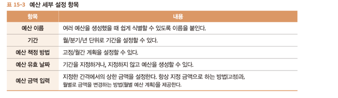

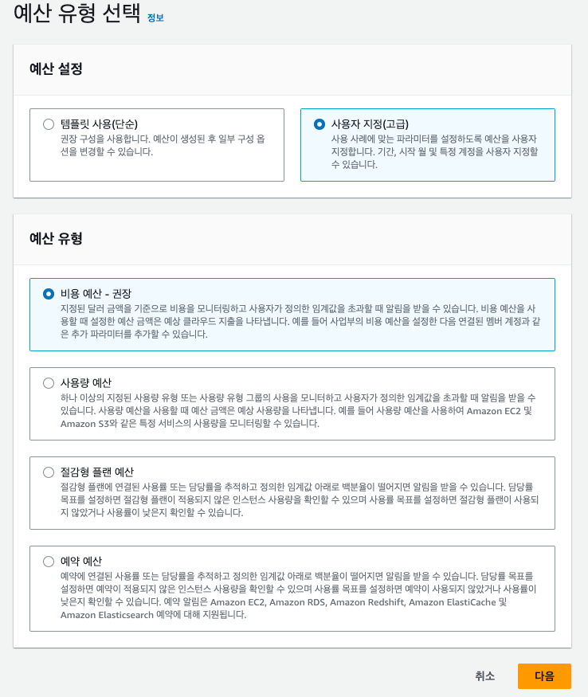

예산 금액의 경우 일반적으로는 서비스에서 이용하는 모든 리소스의 함계 금액을 입력한다.

----

#### 알림 구성
다음으로 알림을 구성한다.

예산 알림이란 일 단위 실적과 예산을 비교해서 실적이 예산을 넘는 경우나 초과할 것이라 예상될 때 알림을 발생하는 기능이다.

필수는 아니지만 예상치 못한 과도한 비용의 지출을 막기 위해 정확하게 설정할 것을 권장한다.

"알림 임곗값 추가" 버튼을 클릭한다.

임계값 설정 항목은 아래와 같다.

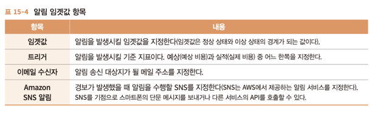

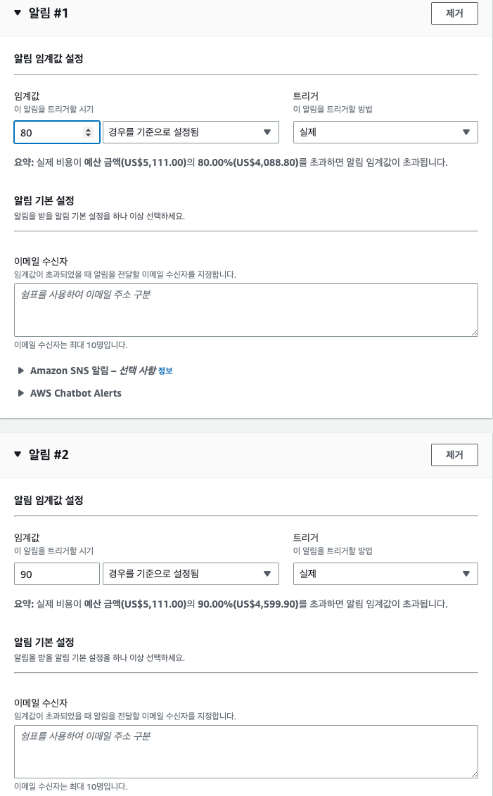

하나의 예산에 대해 여러 개의 알림 설정이 가능하다.

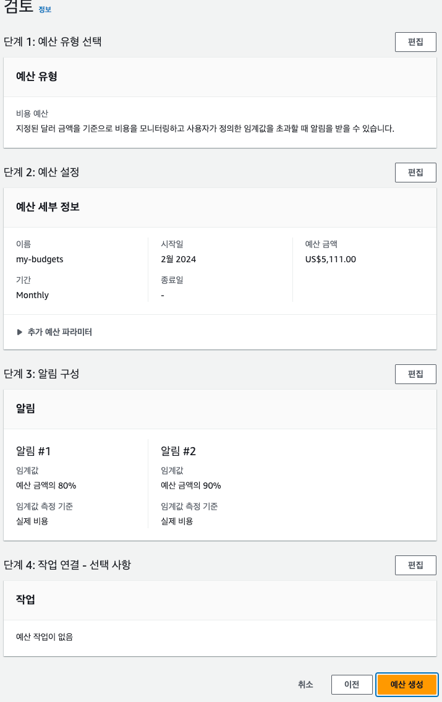

----

# 15.4 일일 요금 확인하기
Cost Explorer를 사용하여 일 단위 또는 시간 단위의 요금을 확인할 수 있다.

## 15.4.1 Cost Explorer 이용
서비스 > AWS Budgets > Cost Explorer > Cost Explorer 시작 > 일별 소비 보기 클릭

이 보고서는 다양한 방식으로 표현가능하다. 예를 들어 특정 그래프는 가장 비용이 많이 드는 리소스를 알기 쉽지만,

합산 금액은 얼마인지 알기 어렵다. 이때 '누적 막대그래프' 등을 사용하는 등 여러 시점에서 그래프를 생성할 수 있다.

----

# 15.5 청구서 확인하기
AWS에서는 월 단위 요금청구서를 보내고 청구서 비용 확인을 한다.

청구서는 계정에 등록된 매일 주소에 보내지고 그 외에 관리 콘솔에서 확인 가능하다.

AWS 결제 대시보드 > 청구서를 클릭하면 조회가 가능하다.

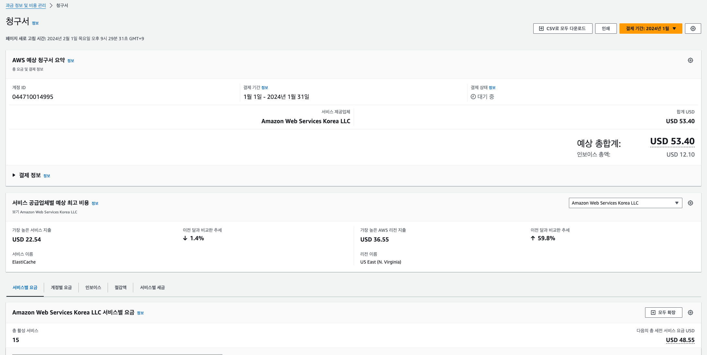

---

# 15.6 예산 개선하기
청구서에 확인된 금액과 14장에 소개된 지표들을 기반으로 리소스 증감을 검토해 예상 금액을 산정하고 다음 달 예산에 반영한다.

