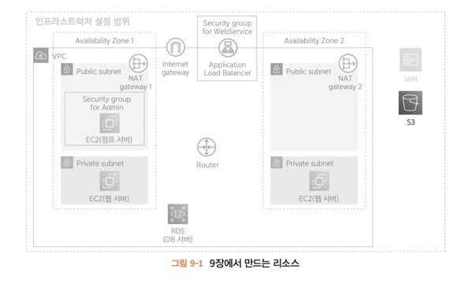

이미지도 웹 서버에서저장해야하는데 용량이 큰 정보는 DB에 들어갈 수 없으므로 전용 저장소가 있으면 다루기 쉽다.

# 9.1 스토리지
스토리지는 데이터를 오랫동안 저장하는 것을 목적으로 제공되는 데이터 저장 장소이다.

가장 쉽게 찾아볼 수 있는 스토리지는 SSD또는 HDD가 있다.

드롭박스, 원드라이브, 아이클라우드 등 클라우드에서 제공되는 온라인 스토리지도 많이 이용한다.

스토리지는 **보조 기억장치** 라고도 하는데 왜 보조일가? 주 기억장치가 따로 있다.

---

# 9.2 S3
5,6 장에서 설명한 EC2인스턴스는 SSD나 HDD를 스토리지로 제공한다.

바로 **EBS(Elastic Block Store)** 이라는 이름의 서비스이다.

다만 EBS를 스토리지로 사용하면 아래와 같은 문제점이 발생한다.

> EC2 인스턴스의 OS역시 관리해야한다.
> 
> 예측하지 못한 장애가 발생 시, 대응해야 한다.
> 
> EC2 인스턴스를 사용하지 못할 가능성이 있다. (1년에 약 5분 정도 서비스가 정지될 가능성이 있다.)
> 

이런 문제를해결하고자 AWS에서는 **S3(Amazon Simple Storage Service)** 를 제공한다.

---

## 9.2.1 S3의 작업 범위와 비용
S3는 스토리지 관리를 수행하는 매니지드 서비스이다. 위 문제를 해결하기 위해 아래 환경을 제공한다.

S3는 내결함성과 비용 측면에서 EBS보다 압도적으로 우수하다.

EBS의 경우에는 AWS에서 보증하는 수치가 없다.

한편 S3는 내구성 99.9999%를 달성하도록 설계되었다고 명세되있다. 

수치상으로는 1천만개의 파일을 1만년 동안 손실 없이 저장할 수 있을 정도이다. 

실무에서는 손상되어 사라질 일이 거의 없다고 생각할 만큼 신뢰성이 높다.

비용은 용량에 따라 계산된다. 단순 비교는 어렵지만 EBS에 비하면 EBS가 5배 정도 높다.

그리고 EBS는 EC2 인스턴스 비용도 함께 지불해야 한다.

> 무조건 S3가 스토리지로 좋다고 생각되겠지만 외부 스토리지 서비스이기 때문에 C,D 드라이브 등으로 활용 될 수 없으며 리눅스나 맥에서 파일시스템처럼
> 
> 마운트 할 수 없다.
>> 1. C 드라이브: 대개 시스템 및 부팅에 필요한 파일들이 저장되는 기본적인 드라이브로, Windows 운영 체제가 설치된 곳입니다. 일반적으로 C 드라이브는 운영 체제와 프로그램 파일들이 저장되어 있어 시스템의 핵심 부분을 담당합니다.
>>
> >     D 드라이브: 일반적으로 사용자 데이터, 추가 소프트웨어, 미디어 파일 등을 저장하는 데 사용됩니다. D 드라이브는 주로 사용자가 직접 관리하는 영역으로, 개인 파일, 문서, 음악, 동영상 등을 저장할 때 주로 이용됩니다.
>>
> >
> > 2. 리눅스와 macOS에서 "마운트"는 파일 시스템을 특정한 디렉터리에 연결하는 프로세스를 나타냅니다. 이 과정을 통해 외부 장치나 다른 파일 시스템을 현재 파일 시스템의 일부로 사용할 수 있게 됩니다. 다시 말해, 마운트는 특정 디렉터리에 다른 파일 시스템을 연결하여 사용하는 것입니다.
> >     예를 들어, USB 플래시 드라이브를 리눅스나 macOS 시스템에 연결하면, 해당 드라이브는 일반적으로 자동으로 마운트됩니다. 이로써 시스템은 USB 드라이브의 파일 시스템을 읽고 쓸 수 있게 되며, 특정 디렉터리에 마운트되어 있는 것처럼 사용자에게 제공됩니다.
> > 

---

9.2.2 S3와 VPC의 관계
2~8장의 자원들은 모두 VPC안에 생성했지만 S3는 VPC 밖에 생성한다. 따라서 접근 방법을 아래 두 가지를 고려해야 한다.
> 1. 인터넷으로부터 직접 접근
> 2. VPC로부터 접근
>

VPC안에 리소스에서 S3로 접근할 때는 S3 버킷에대한 접근 권한이 필요하다. 

이 권한은 일반적으로 IAM의 **역할**을 사용한다. 역할을 먼저 생성하고 역할을 EC2에 할당한다.

~~~
Amazon Web Services (AWS) Identity and Access Management (IAM)에서 역할(Role)과 정책(Policy)은 서로 다른 개념이며 다른 목적을 가지고 있습니다.

역할 (Role):

역할은 AWS 리소스 간에 안전하게 인증 및 권한 부여를 할 수 있도록 하는 것입니다.
일반적으로 EC2 인스턴스, Lambda 함수, 사용자 등과 같은 AWS 리소스에게 역할을 할당하여 그 역할이 가지는 권한을 통해 해당 리소스가 다른 AWS 서비스에 접근할 수 있도록 합니다.
역할은 일시적인 보안 자격 증명을 사용하여 다른 AWS 리소스와의 신뢰 관계를 설정할 수 있습니다.

정책 (Policy):

정책은 AWS IAM에서 사용자, 그룹 또는 역할에 대한 권한을 정의하는 JSON 문서입니다.
정책은 특정 작업을 수행할 수 있는 권한과 리소스에 대한 접근 권한을 지정합니다.
정책은 여러 리소스와 사용자에게 연결될 수 있습니다. 예를 들어 특정 S3 버킷에 대한 읽기 및 쓰기 권한을 부여하는 정책을 만들 수 있습니다.

간단히 말해서, 역할은 특정한 업무나 작업을 수행하는 AWS 리소스에 부여되는 권한이며, 정책은 권한의 집합으로써
, 사용자, 그룹, 또는 역할에 할당되어 특정 작업을 수행할 수 있게 합니다. 역할은 보통 정책을 가지고 있어 해당 역할이 어떤 작업을 수행할 수 있는지를 정의합니다.
~~~

---

## 9.2.3 S3 시스템
S3에 데이터를 저장하려고 하면 우선 **버킷(bucket)** 을 생성해야 한다. 버킷은 S3에서 관리하는 데이터를 하나로 모은 단위이다.

버킷 안에는 서비스에서 이요하는 데이터인 **객체** 를 저장한다.

객체는 파일에 해당되며 텍스트, 이미지,음성, 동영상 등으로 취급할수 있다.

---

# 9.3 S3 버킷 생성하기

주의할 점은 같은 리전에서 모든 버킷이 중복된 이름을 피해야 한다는 것이다.

따라서 서비스 이름이나 도메인 이름을 포함시키는 편이 좋다.

데이터의 의도치 않은 열람이나 변경을 방지하기 위해 설정하고, 추후에 용도에 맞춰 필요한 접근 권한을 부여하면 된다.

---

# 9.4 역할을 생성해 EC2에 적용하기

웹 서버로부터 S3에 접근할 수 있도록 설정한다.

## 9.4.1 생성내용

### 엔티티와 사용 사례
역할을 할당 할 수 있는 대상인 **엔티티** 를 지정한다.

# 9.5 작동 확인하기
ec2에 ssh로 접근하여 업로드를 해본다.

Amazon Linux2는 S3와 같은 AWS 리소스를 조작하는 명령어를 제공한다.

먼저 홈 디렉토리에 텍스트 파일을 생성한다.

그 후 명렁어를 통해 업로드 한다.

~~~
aws s3 cp s3uploadsample1.txt s3://aws-intro-wonhoshin-upload/text.txt
~~~

