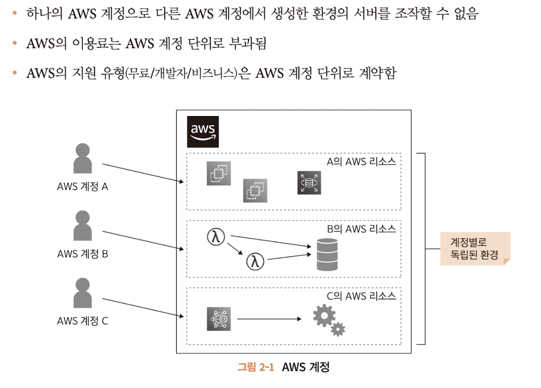

# 2. AWS 계정 만들기
## 2.1 AWS 계정이란?

>aws 계정은 aws 리소스를 관리하는데 사용된다.
> 
> 다음을 유의 해야 한다.
> 
>> * 하나의 AWS 계정으로 다른 AWS 계정에서 생성한 환경이 서버를 조작할 수 없음.
>> * AWS 이용료는 계정 단위로 부과됨
>> * AWS의 지원 유형 (무료/개발자/비지니스)은 AWS 계정 단위로 계약함.

---

## 2.2 루트 사용자
AWS 계정을 생성하면 자동으로 사용자도 만들어지고 이를 **루트사용자** 라고 한다.

루트 사용자는 AWS 계정에 관한 모든 서비스를 조작할 수 있는 강력한 권한을 갖는다.

일반적으로 AWS 계정 안에 개발자에게 필요한 권한만 가지는 별도 사용자를 만들고 이 사용자로 개발을 진행한다.

