AWS 계정을 처음 만든 상태에서는 모든 접근 권한을 가진 루트 사용자 한 명만 존재하기 때문에 안전하게 조작할 수 있는 준비를 해본다.

# 3.1 IAM

**IAM(Identity and Access Management)** 은 AWS의 리소스 접근을 안전하게 관리하는 시스템으로 주로 **인증**과 **접근 허가** 기능을 구현한다.

---

## 3.1.1 인증
> **인증** 이란 현재 이용하는 사용자가 누구인지에 관한 정보를 AWS에 전달하는 과정이다.

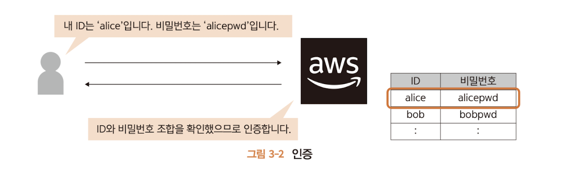

---

## 3.1.2 접근허가
> **접근허가**란 AWS 사용자가 어떤 기능을 사용할 수 있는가를 관리하고 허가하는 것이다.

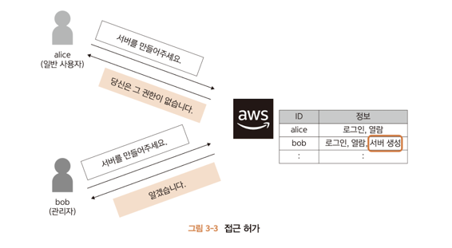

---

## 3.1.3 루트 사용자
처음 회원가입 시, 루트 사용자가 생성되고 콘솔에 로그인되는데 모든 권한이 허용된 계정이기 때문에

AWS 계약 해지나 사용자 관리 등의 작업 이외에는 사용하지 않고

통상적인 개발에서는 **일반 사용자(IAM 사용자)** 를 만들고 권한을 부여한다.

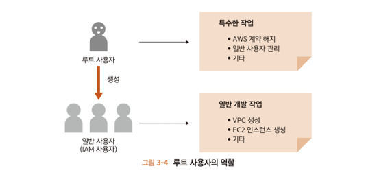

---

## 3.1.4 사용자와 그룹
* 사용자 그룹 별로 접근 허가 방법도 제공한다.
* 사용자 수가 적더라도 그룹을 이용해서 관리할 것을 권장한다.

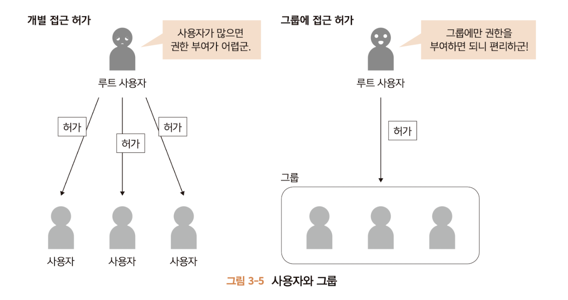

---

# 3.2 IAM 대시보드를 이용해 안전성 확인하기
> * AWS 계정 루트 사용자의 액세스 키 잠금
> * MFA 활성화
> * 개별 IAM 사용자 생성
> * 사용자 그룹을 이용한 접근 권한 할당
> * 사용자에 대한 강력한 암호 정책 구성
 
---

## 3.2.1 AWS 계정 루트 사용자의 액세스 키 잠금
대시보드로 조작하는 방법 이외에 프로그램으로 조작하려면 **엑세스 키** 가 필요하다.

강력한 루트 사용자의 엑세스 키는 없는 상태로 둬야 한다.

---

### 3.2.1.1 엑세스 키 삭제하기
1. 보안 자격 증명 관리 화면 열기
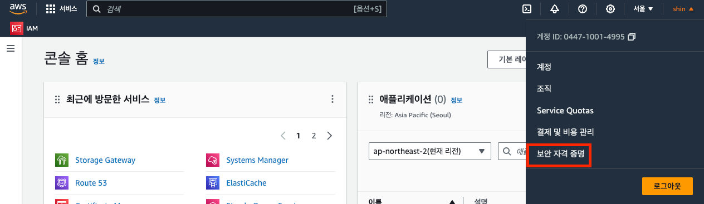

2. 엑세스 키 삭제
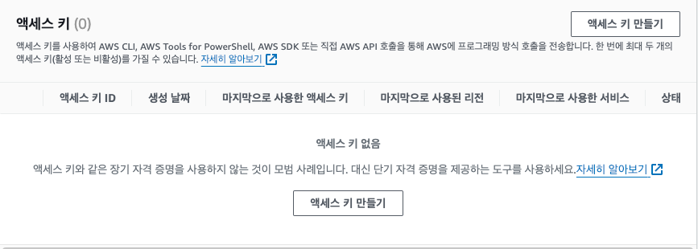

---

## 3.2.2 MFA 활성화
>초기 상태에서 루트 사용자는 메일 주소와 비밀번호의 조합만으로 로그인 할 수 있다.
> 
>루트 사용자에 강력함에 비해 안전한 로그인 방법이 아니다.
> 
> 따라서 **MFA(Multi-Factor-Authentication)**를 사용한다.

* AWS에서는 바밀번호(아는 요소) + 인증 디바이스(가진 요소) 두 가지로 MFA를 수행한다.
* USB로도 할 수 있지만 널리 보급된 스마트폰을 **가상 MFA 디바이스** 로 활용하는 방법이 많이 쓰인다.

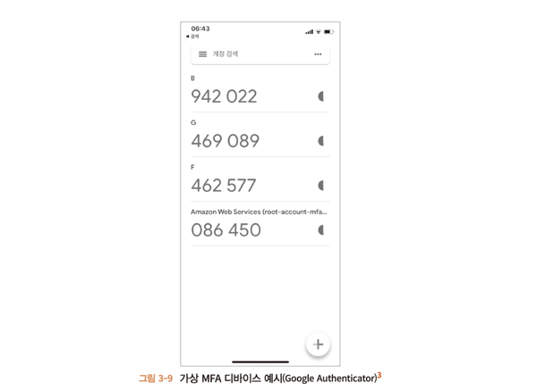

### 3.2.2.1 인증용 스마트폰에 MFA용 애플리케이션 설치
여러 개가 있는데 Google Authenticator를 사용해본다.

1. 스마트폰에 MFA용 어플리케이션 설치
2. '보안 자격 증명' 관리 화면 열기
3. MFA 활성화
4. 디바이스 종류 선택
5. 가상 MFA 디바이스 설정

---

## 3.2.3 개별 IAM 사용자 생성
루트 사용자는 강력한 권한이 있으므로 일반 사용자(IAM 사용자)를 생성한다.

1. IAM 대시보드에서 '사용자 추가' 실행
2. 사용자 세부 정보 설정
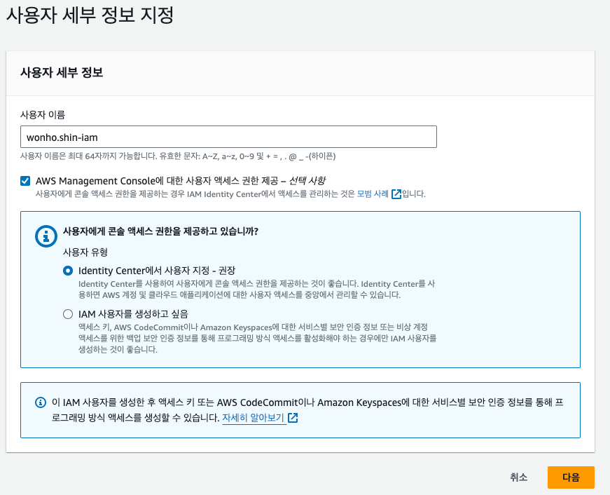
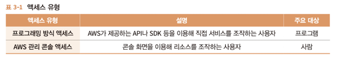

3. 권한 설정 
4. 태그 추가
태그는 지정한 이름 이외에 사용자를 구분하는 정보를 추가한다.

IAM 사용자를 수백 명 정도의 대규모로 등록할 때는 이름과 함께 관리자, 부서이름 등을 추가로 입력해 관리할 수 있도록 한다.

5. 검토

---

## 3.2.4 사용자 그룹을 이용한 접근 권한 할당
> 사용자 그룹에 접근 권한을 할당해 효율적으로 누락 없이 사용자에게 접근 권한을 부여한다.

1. 대시보드에서 그룹 생성

2. 권한 정책 연결
접근 권한이 매우 많으므로 이를 묶은 **정책**을 제공한다. 해당 정책을 **그룹**에 묶을 수 있다.
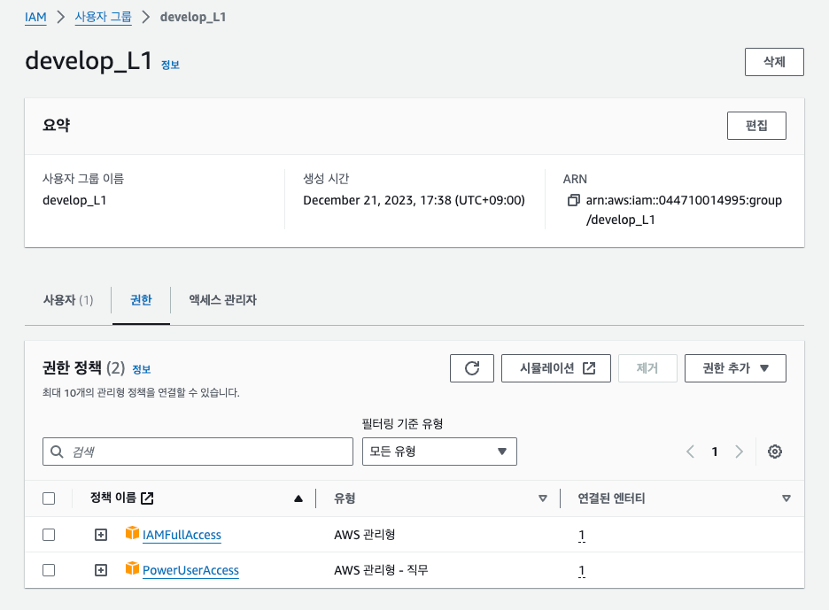

>PowerUserAccess 정책은 AWS 안의 리소스에 대한 모든 접근 구너한을 가진다.
> IAMFullAccess 정책은 IAM에 대한 모든 접근 권한을 갖는다.

---

## 3.2.5 사용자에 대한 강력한 암호 정책 구성
1. '암호 정책 변경' 관리 화면 열기
   1. IAM 대시보드 > 엑세스 관리 > 계정 설정을 누른다.
2. 암호 정책 설정
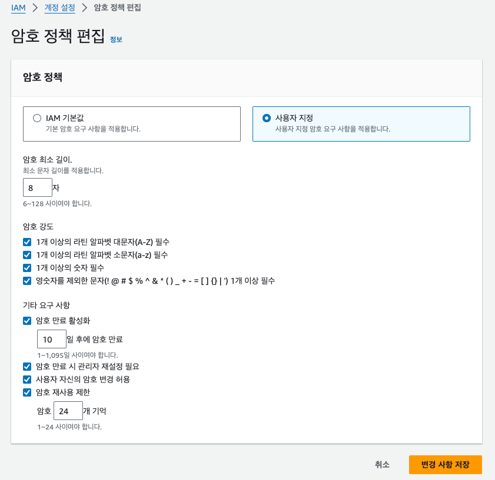

