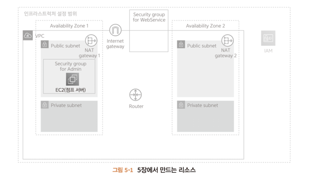

# 5.1 점프 서버란?
aws에 다양한 리소스를 생성한 뒤에는 해당 리소스에 외부로부터 접속해서 리소스에 대한 설정을 수행한다.

리소스로의 접속은 제한된 관리자만 수행 할 수 있어야 하는데 모든 리소스에 수행하기란 어렵고 설정이 누락될 수 있다.

따라서 모든 **리소스에 접속할 수 있는 입구인 점프 서버(배스천)**  를 준비하고, 해당 서버를 경유 해야만 각 리소스로 접근가능하게 설정한다.

> 점프 서버는 EC2를 이용해 구축한다. EC2는 가상 서버로 CPU, MEmory, Disk 등이 제공되며 OS를 설치할 수 있다.
> 
> 점프 서버 자체는 리소스로의 통로이므로 성능이 낮아도 된다.
> 
> 접속 방법은 OS에 따라 다양한데 책에선 리눅스로 구축된 서버를 사용하며 SSH를 이용해 접속한다.
> 
> > SSH는 암호/인증 기술을 이용하여 네트워크를 경유해 서버 등에 접속해서 원격 조작하는 프로토콜이다.
> 
> > SSH를 경유하려면 비밀 키와 공개 키라는 키 페어를 준비해야 한다.
> 

---

# 5.2 SSH 접속에 필요한 키 페어 준비하기
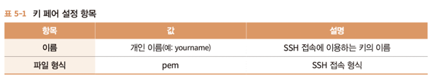

키 페어는 기본적으로 작업하는 사람에게 속한다. 따라서 키 페어의 이름은 이제까지 소개한 서비스와 같이 wonho.shin-gateway-01 등이 아닌

고유한 작업자의 이름을 사용하는게 좋다.

파일 형식은 PC에 설치된 SSH 클라이언트 마다 다른데 윈도우 10 이전에는 PuTTY라는 SSH 클라이언트가 널리 사용되었고, ppk 확장자를 사용한다.

한편, 리눅스나 맥, 윈10 이후에서는 OS에서 ssh 명령어를 제공하며 pem 형식을 이용한다.

---

## 5.2.2 키 페어 생성 순서
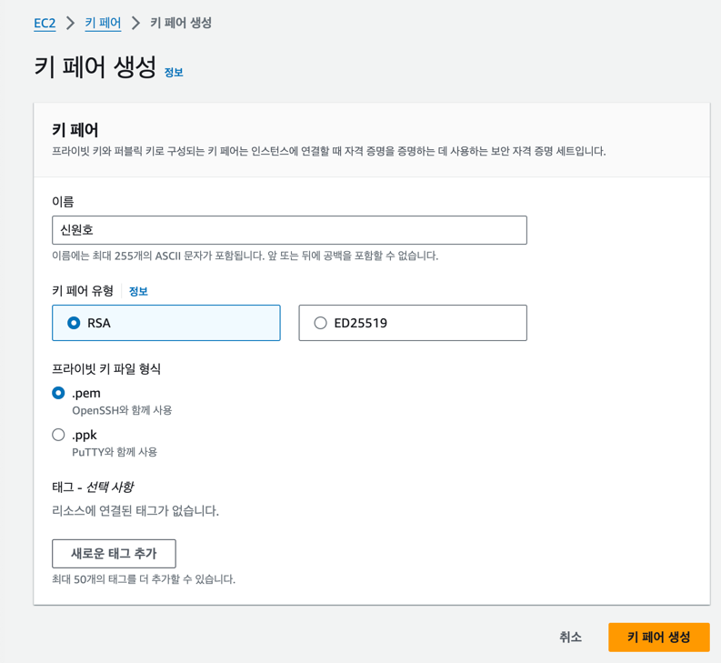

생성 직후 다운로드 화면이 생성한 키 페어 비밀 키를 얻을 유일한 기회이다.

다운로드 하지 않거나 키를 잃어버린 경우, 새로 생성해야 하고, 기존 서버의 공개 키를 바꿔야 한다.

---

# 5.3 점프 서버 준비하기
EC2를 사용하여 구현하므로 EC2를 생성하며, 아래 표는 기본 값에서 변경된 값만을 서술한다.

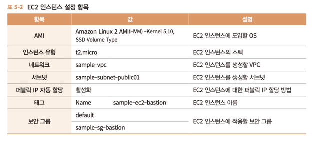
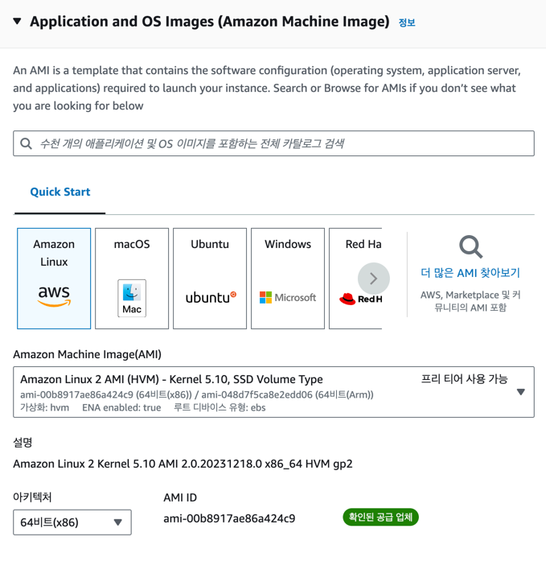
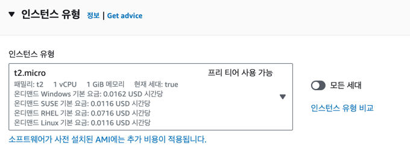
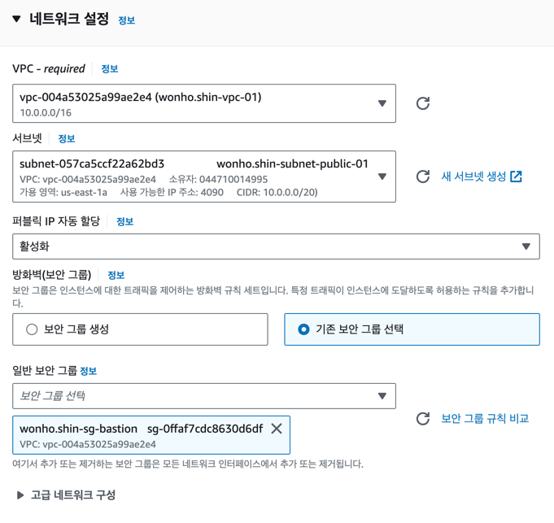
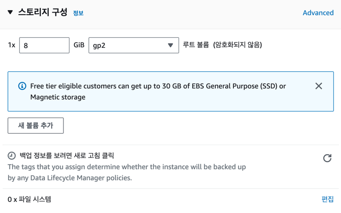

> 책에서 IP 주소를 제한하지 않은 이유
>  > bastion sg는 모든 요청에 대해 SSH를 허용하고 있는데, 인터넷 프로바이더의 퍼블릭 IP가 고정되어있지 않기 때문이다.
>  > 학교, 회사 등에서 고정 퍼블릭 IP를 제공한다면 한정하는 편이 좋다.

---

# 5.4 접속 확인하기
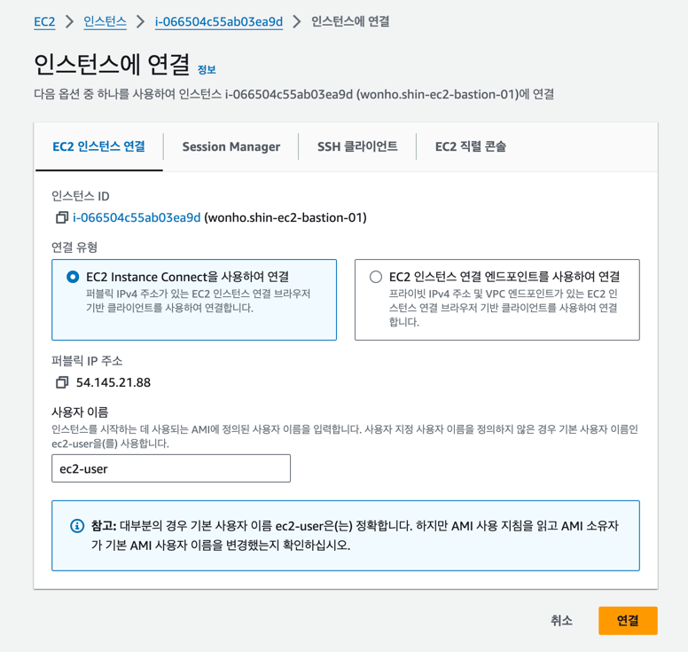
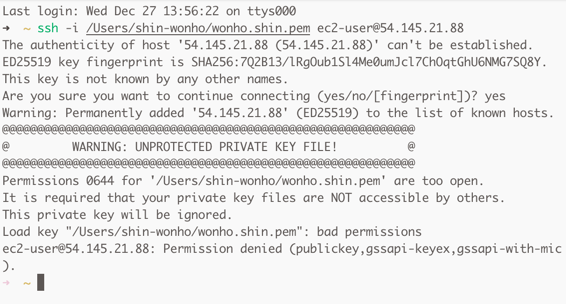

파일의 접근 권한이 너무 개방되어서 문제가 발생하였다. 

개인 키 파일의 권한을 조정하여 다른 PC사용자가 접근할수 없도록 해야 한다.

아래 명령어를 수행한다.

~~~
chmod 600 /Users/shin-wonho/.ssh/wonho.shin.pem
~~~

>여기서 사용된 숫자 "600"의 의미는 다음과 같습니다:
>
>첫 번째 숫자(6): 소유자(파일 소유자, 여기서는 당신)에 대한 권한
> 
>두 번째 숫자(0): 파일을 소유자의 그룹에 속한 다른 사용자들에 대한 권한
> 
>세 번째 숫자(0): 기타 모든 사용자에 대한 권한
> 
>각 숫자는 권한을 나타내며, 권한은 다음과 같이 매핑됩니다:
>
>4: 읽기 권한
> 
>2: 쓰기 권한
> 
>1: 실행 권한
> 
>따라서 "600"은 소유자에게는 읽기 및 쓰기 권한을 부여하고, 그룹 및 기타 사용자에 대해서는 어떤 권한도 부여하지 않는 것을 의미합니다. 이렇게 함으로써 해당 파일에 대한 권한이 소유자에게만 주어지고 다른 사용자들은 아무 권한도 갖지 않게 됩니다.
>
>간단히 말하면, chmod 600은 해당 파일을 읽기 및 쓰기 권한이 있는 소유자만이 사용할 수 있도록 설정하는 것입니다.
>

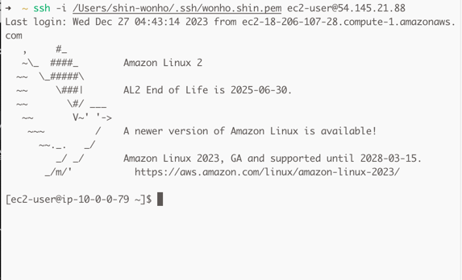

---
    
