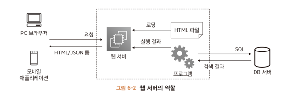
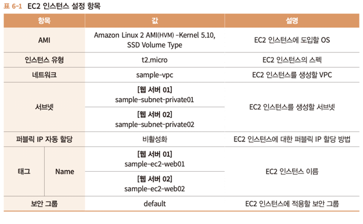
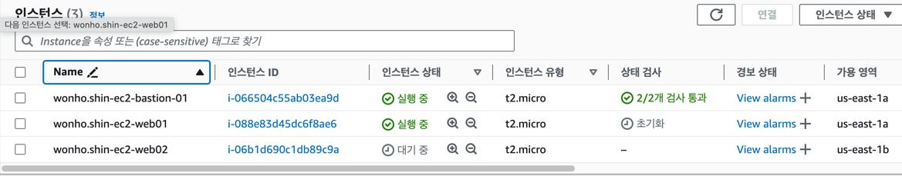
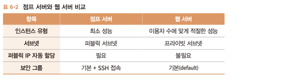
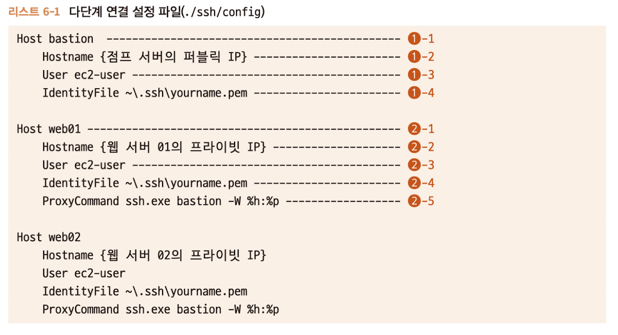
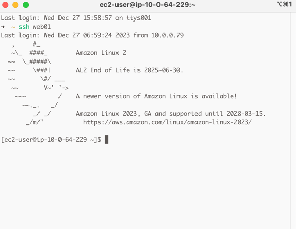
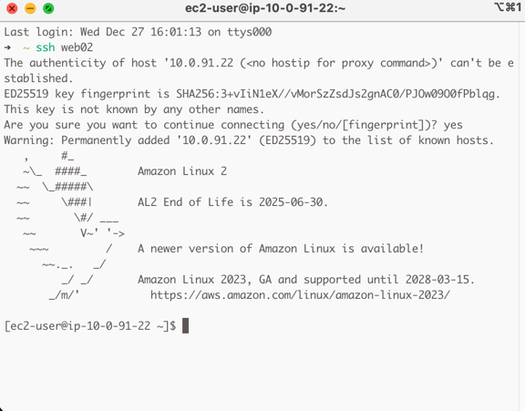

# 6.1 웹 서버란?
웹 서버는 브라우저나 애플리케이션으로부터 요청을 받아서 HTML이나 JSON등의 응답을 반환하는 역할을 한다.

아래 그림처럼 프로그램의 실행 결과를 반환하기도 한다.

---

# 6.2 웹 서버 준비하기
아래 표와 같이 준비한다.

2개의 인스턴스를 생성하고 ec2가 생성될 서브넷 위치의 차이가 있다.

---

## 6.2.2 점프 서버와 비교
점프 서버와 웹 서버는 두 가지 차이 점이 있다.

> 점프 서버는 시스템 관리자가 가끔 이용한다. 웹 서버는 웹 서비스 사용자가 항상 연결을 시도한다.
> 
> 점프 서버는 인터넷에서 직접 연결된다. 웹 서버는 LB를 통해 간접적으로 연결된다.
> 
> 

# 6.3 접속 확인하기
EC2 인스턴스를 생성했다면 ssh 명령을 통해 연결을 확인할 수 있다.

웹 서버는 private subnet에 생성 했으므로, bastion을 경유하여 연결한다.

간단히 연결하려면 점프서버에 SSH로 연결 한 후에 다시 웹 서버에 SSH를 연결하는 방식을 사용하지만 문제점 이 있다.

> ssh명령어를 2 번 입력해야 한다.
> 
> 비밀 키 파일을 점프 서버에 전송해야 한다.
> 

그러므로 ssh 명령어가 제공하는 다단계 연결기능을 사용한다.

## 6.3.1 다단계 연결하기
다단계 연결 설정은 config라는 이름의 파일(확장자 없음)을 생성하고 그 안에 기술한다.

해당 파일은 비밀 키 파일과 마찬가지로 홈 디렉터리에 .ssh폴더 안에 저장한다.

**Host** 항목은 연결할 서버 별로 설정하며 별명을 자유롭게 붙인다.

**Hostname** 에는 연결할 서버의 IP 주소 또는 서버 이름을 입력한다.

주의할 점은 여기에는 연결 대상 서버에 직접 접근하는 서버의 정보를 지정한다는 점이다.

그러므로 bastion에는 점프 서버의 public IP를, web 서버는 bastion을 경유하므로 bastion에서 식별 가능한 private IP를 입력한다.

**User**에는 연결할 떄의 사용자 이름을 지정한다.

**IdentitiyFile**에는 비밀 키의 경로를 지정하는데 Hostname과 달리 ssh 명령을 처음 수행하는 기기의 경로를 지정한다.

**ProxyCommand**는 경유하는 점프 서버의 정보를 지정하는데, 점프 서버 자체에는 이 정보는 불필요 하다.
아래와 같이 전형적으로 설정한다.

~~~
    ssh.exe {bastion alias} -W %h:%p
~~~

> ssh.exe: SSH 클라이언트 프로그램인 SSH를 실행하는 명령어
> 
> {bastion alias}: 실제로는 중괄호 안에 들어간 내용이 실제 bastion 호스트의 별칭(alias)으로 바뀌어야 합니다.
> 
> -W %h:%p: SSH 프록시(Proxy) 연결을 설정하는 옵션입니다. 이 옵션을 사용하면 중간에 위치한 bastion 호스트를 통해 최종 목적지에 직접 연결할 수 있습니다.
> 
> %h는 목적지 호스트를 나타내고, %p는 목적지 포트를 나타냅니다.
>
> 즉, -W %h:%p는 현재 SSH 연결을 통해 전달되는 데이터를 목적지 호스트와 포트로 전달하도록 지시합니다.
>

