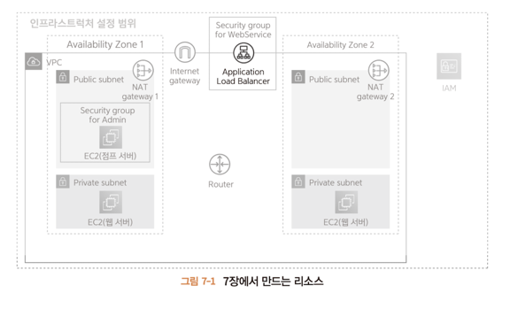

# 7.1 로드 벨런서란?
* 사용자가 늘어나면 웹 서버 한 대로 요청을 깔끔하게 처리할 수 없는 시점이 온다.
* 웹 서버를 여러 대 준비해서 성능을 높일 수 있는데 이를 **스케일아웃** 이라고 한다.
* 브라우저나 어플리케이션 등 클라이언트는 웹 서버만 늘린다고 새로 증가된 서버를 사용할 수 없다.
* 스케일 아웃을 할 때는 서비스를 제공하는 측에서 새로운 시스템이 필요하다.

---

## 7.1.1 로드 벨런서의 역할
로드 벨런서는 스케일 아웃을 수행하는 하나의 방법이다. 로드 벨런서의 역할인 이것말고도 여러가지가 있다.
* 요청 분산
* SSL 처리
* 부정 요청 대응

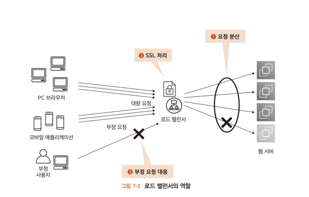

---

### 요청 분산
인터넷으로부터 전송된 요청을 여러 웹 서버에 균등하게 분산한다. 화장실에 한줄서기와 비슷하다.

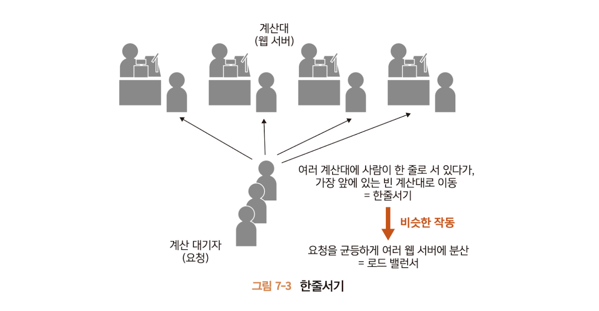

---

### SSL 처리
송수신 데이터를 암호화하는 **SSL(Secure Sockets Layer)** 처리다.

외부로부터의 접근 중 안전하게 정보를 보내기 위해 HTTPS 프로토콜로 통신할 때가 있는데 이때 SSL을 사용한다.

URL 주소가 https://로 시작하는 웹사이트가 이에 해당한다.

이때 브라우저와 서비스 사이를 흐르는 데이터는 암호화 된다.

데이터 암호/복호화 처리는 복잡해서 웹 서버에서 이를 수행하면 부하가 걸려 제 성능을 다하지 못할 수가 있다.

LB에서 이를 처리하는 전용 시스템이 제공되므로 더 빠르게 처리할 수 있다.

---

### 부정 요청 대응
LB가 없다면 웹 서버에 올바르지 못한 요청이 들어올 수 있다.

웹 서버에서 이를 처리하면 부하가 심하다.

LB에는 부정한 접근에 대응하는 시스템이 제공된다.

---

## 7.1.2 AWS에서 제공하는 로드 벨런서
AWS에서는 **ELB(Elastic Load Balancing)** 를 제공하고 아래 세 가지 LB가 포함된다.
* ALB(Application Load Balancer)
* NLB(Network Load Balancer)
* CLB(Classic Load Balancer)

---

### ALB
HTTP나 HTTPS를 이용한 접근을 분산하는 데 최적화 된 LB이다.

SSL처리를 수행하거나 URL 패턴과 같은 복잡한 조건에서 분산 대상지를 바꾸는 등 고도의 기능을 제공한다.

---

### NLB
기본적인 분산처리 기능만을 제공하지만 다양한 통신 프로토콜에 대응하는 LB이다.

특히 실시간 게임 등에서 양방향 통신을 구현할 때 쓰이는 소켓 통신 등을 분산할 때 이용한다.

---

### CLB
옛날꺼라 특별한 경우가 아니면 안 쓴다.

---

##  7.1.3 로드 벨런서를 이용한 요청 라우팅
웹 애플리케이션을 인터넷에 공개할 때 보통 HTTP(:80) 또는 HTTPS(:443)을 이용한다.

이 설정은 LB에 수행하지만 LB 내부의 웹 서버는 이 설정에 맞출 필요는 없다. 

실제로 웹 서버는 HTTP는 포트번호 1024보다 큰 값으로 요청을 받는다.

LB는 공개한 프로토콜과 포트 번호의 조합을 내부 웹 서버가 받는 조합으로 변환하는 기능을 제공하며 이를 **요청 라우팅** 이라고 한다.

HTTPS를 HTTP로 변환하는 이유는 HTTPS를 이용한 통신의 암호 및 복호 처리를 웹 서버가 아니고 LB에서 수행하기 때문이다.

그러면 웹 서버의 부하를 줄이고 인증서 관리 등의 비용을 줄일 수 있다.

포트 번호를 변환하는 이유는 웹 서버의 보안을 높이기 위해서이다.

리눅스 등의 OS에서는 0 ~ 1023까지의 포트 번호로 데이터를 받으려면 특별히 강력한 권한을 가진 사용자로 작동해야 한다.

하지만 그 프로그램을 나쁜 사람에게 뺏기면 권한도 뺏기기 때문에 LB 내부에 있는 웹 서버에서는 보통 1024 이상의 포트 번호를 사용하여

일반 사용자 권한으로 어플리케이션을 작동한다.

관습적으로 자바는 8080 루비는 3000을 주로 이용한다.

---

# 7.2 로드 벨런서 생성하기

아래 표를 참조하여 생성한다.

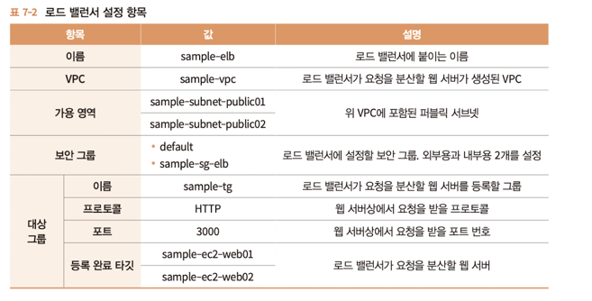

---

## 7.2.2 가용 영역
인터넷 게이트웨이로의 경로가 있는 서브넷을 지정해야 한다.

서브넷을 잘못 지정하면 외부로부터 웹 서버에 도달 할 수 없다.

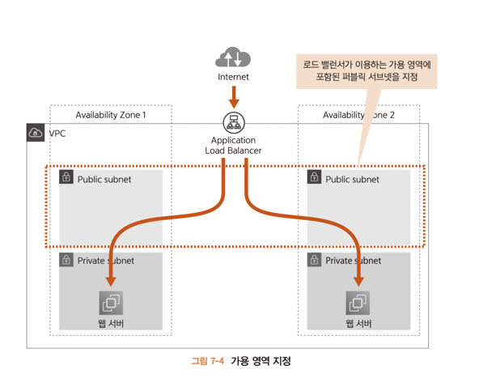

---

## 7.2.3 로드 벨런서와 대상 그룹
ALB의 설정 항목에는 두 가지가 있다.
* 로드 벨런서
* 대상 그룹

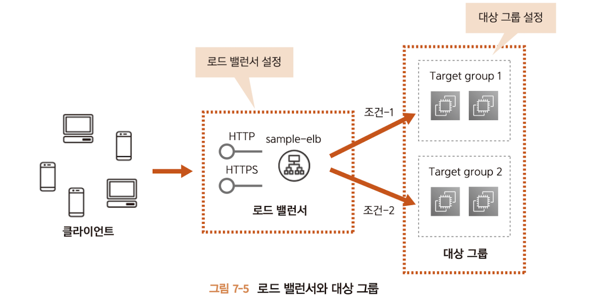

---

### 로드 벨런서
어떤 프로토콜을 이용할 것인지와 같은 설정을 수행한다.

클라이언트로부터 처리를 받는 기능을 **리스너** 라고 한다.

---

### 대상 그룹
어떤 웹 서버에 요청을 분산할 것인지 설정한다.

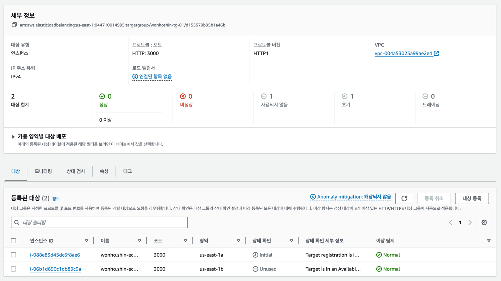

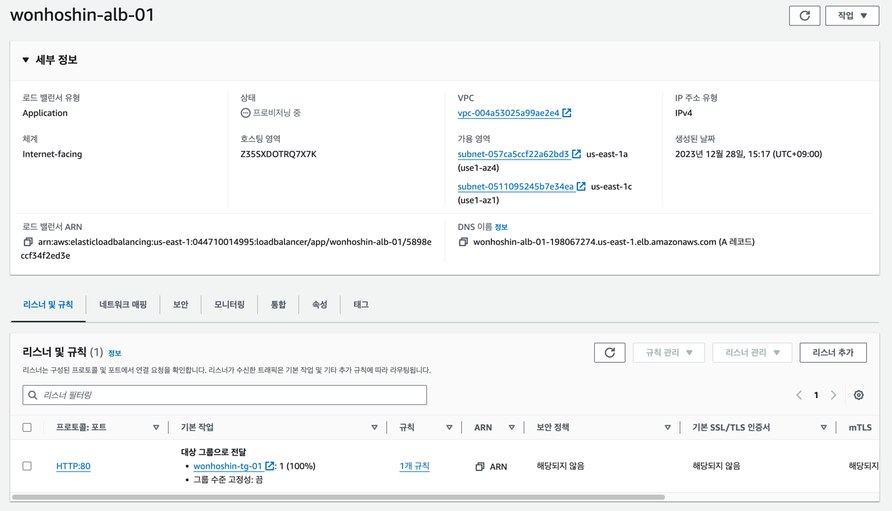

---

# 7.3 작동 확인하기
## 7.3.1 HTTP 요청을 받을 준비

터미널 2개를 실행해서 각각 SSH로 웹서버 2대에 접속한다.

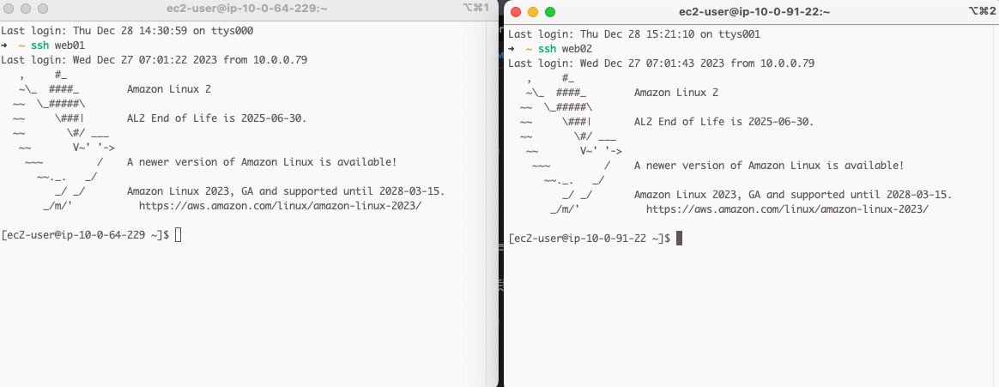

다음 두 가지를 수행한다.

* index.html 생성
* 파이썬으로 HTTP 서버 가동

### index.html 생성
SSH를 통해 연결할 웹 서버의 홈 디렉토리에 VIM 에디터 등을 사용하여 index.html을 생성한다.
~~~
<html><body>hell world</body></html>
~~~

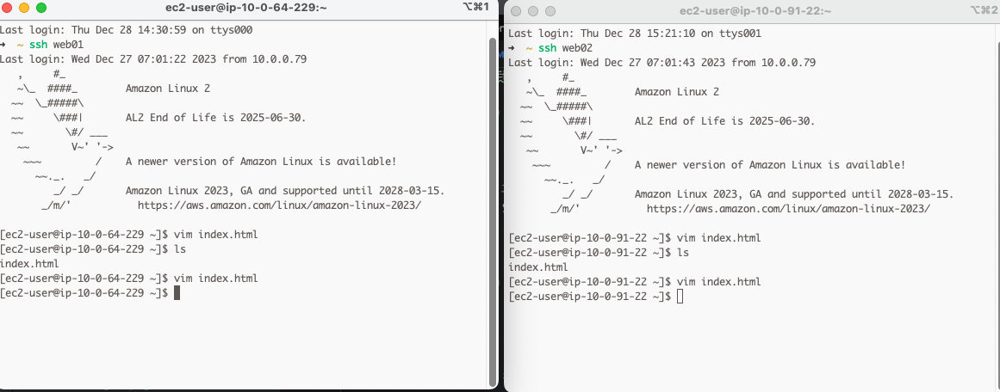

### 파이썬으로 HTTP 서버 가동
서버 기동 명령은 아래와 같다. 연결이 성공하면 헬스 체크가 정기적으로 수행되고 로그가 표시된다.
~~~
python -m SimpleHTTPServer 3000
~~~
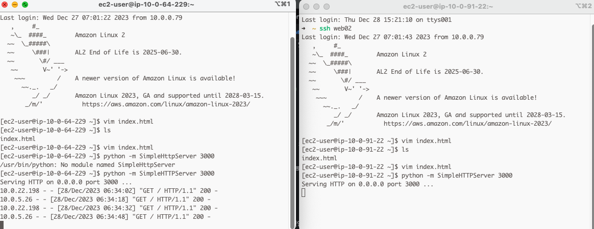

---

## 7.3.2 요청 라우팅 확인
LB는 곧바로 요청을 라우팅 하지 않는다.

헬스 체크를 수 차례 수행하고 요청이 모두 성공해야 라우팅하기 시작한다.

대상그룹에서 확인가능하다.

status가 healthy로 바뀌면 라우팅이 시작된다.

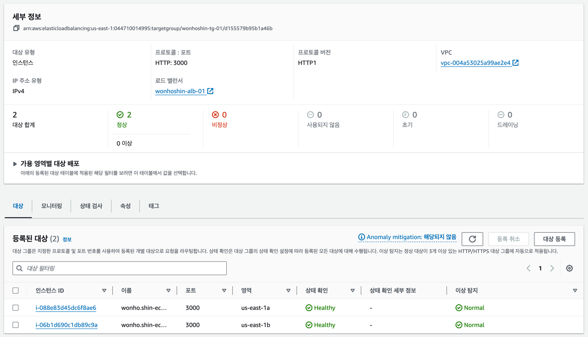

---

## 7.3.3 브라우저에서 접근
LB 들어가서 DNS 확인해서 접속해보자

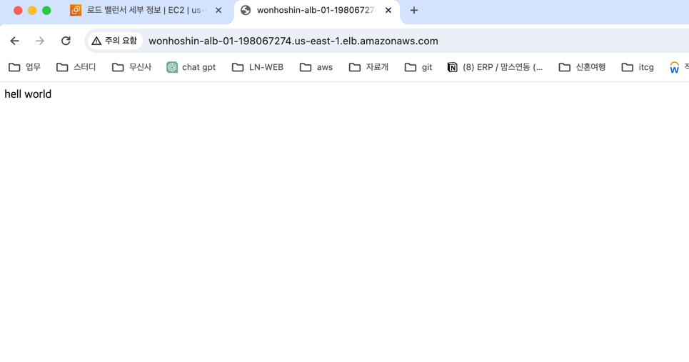

