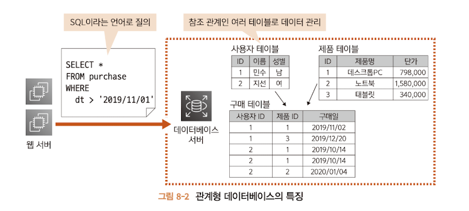

# 8.1 데이터베이스 서버란 ?

DB는 폭 넓은 의미로 쓰이는데 책에서는 RDB(Relational Data Base)를 뜻 한다.

RDB는 아래 특성을 갖는 DB이다.

> 참조 관계의 여러 테이블로 데이터 관리
> 
> SQL이라는 전용 질의 언어로 데이터 입출력 수행

웹 서비스를 구축할 땐 웹 서버로 부터 질의를 받아 결과를 반환하는 **데이터베이스 서버**를 많이 사용한다.

---

# 8.2 RDS
RDB제품은 주로 OS가 작동하는 서버상에 설치해 작동하는 프로그램으로 제공된다.

그러므로 EC2를 생성하고 여기에 RDB를 설치하여 제공할 수 있지만 아래와 같은 문제가 있다.

> 데이터베이스 제품을 설치해야 한다.
> 
> EC2의 OS 자체를 관리해야 한다. (보안 등)
> 
> 예측하지 못한 장애에 대응해야 한다.

이를 해결하고자 AWS에서는 **RDS(Amazon Relational Dabatabse Service)** 라는 매니지드 서비스를

제공한다. 제품과 성능 지정만 하면 간단하게 RDB를 제공하는 서버를 구축할 수 있다.

---

~~~
컴퓨팅 서비스:

Amazon Elastic Compute Cloud (EC2)
AWS Lambda
AWS Fargate (서버리스 컨테이너 오케스트레이션)
데이터베이스 서비스:

Amazon RDS (관계형 데이터베이스 서비스)
Amazon DynamoDB (NoSQL 데이터베이스)
Amazon Redshift (데이터 웨어하우스)
저장 서비스:

Amazon S3 (간단한 저장 서비스)
Amazon EBS (탄력적 블록 스토어)
Amazon Glacier (저렴한 아카이브 저장)
네트워킹 서비스:

Amazon VPC (가상 사설 클라우드)
AWS Direct Connect (전용 네트워크 연결)
Amazon Route 53 (DNS 웹 서비스)
분석 서비스:

Amazon EMR (탄력적 맵리듀스)
Amazon Athena (S3 쿼리 서비스)
Amazon QuickSight (비즈니스 분석)
머신러닝 서비스:

Amazon SageMaker
Amazon Comprehend (자연어 처리)
Amazon Rekognition (이미지 및 비디오 분석)
보안, 식별 및 규정 준수:

AWS Identity and Access Management (IAM)
AWS Key Management Service (KMS)
Amazon GuardDuty (지능형 위협 감지)
애플리케이션 통합:

Amazon Simple Queue Service (SQS)
Amazon Simple Notification Service (SNS)
AWS Step Functions (분산 애플리케이션 조정)
개발자 도구:

AWS CodeDeploy
AWS CodePipeline
AWS CodeCommit
~~~

---

## 8.2.1 RDS 시스템
RDS의 시스템은 아래와 같은 4개로 구성된다.

> 데이터베이스 엔진
> 
> 파라미터 그룹
> 
> 옵션 그룹
> 
> 서브넷 그룹

### 데이터베이스 엔진
실제로 데이터가 저장되거나 질의에 응답하는 DB 본체.

성능 / 내결함성을 높이기 위해 내부적으로 여러 인스턴스로 구성된다.

### 파라미터 그룹
DB 엔진의 고유 설정을 수행하여 언어나 DB튜닝을 설정 할 수 있다.

~~~
innodb_buffer_pool_size:

설명: InnoDB 버퍼 풀의 크기를 지정합니다.
예시: innodb_buffer_pool_size = 5368709120 (5GB)
max_connections:

설명: MySQL 서버에 허용된 최대 동시 연결 수를 제어합니다.
예시: max_connections = 100
innodb_log_file_size:

설명: InnoDB 로그 파일의 크기를 지정합니다.
예시: innodb_log_file_size = 134217728 (128MB)
key_buffer_size:

설명: MyISAM 인덱스를 위한 키 버퍼의 크기를 설정합니다.
예시: key_buffer_size = 268435456 (256MB)
query_cache_size:

설명: 쿼리 캐시의 크기를 지정하여 쿼리 결과를 캐시합니다.
예시: query_cache_size = 67108864 (64MB)
innodb_file_per_table:

설명: InnoDB 테이블당 별도의 파일을 사용할지 여부를 지정합니다.
예시: innodb_file_per_table = ON
innodb_flush_log_at_trx_commit:

설명: InnoDB 로그의 플러시 정책을 지정합니다.
예시: innodb_flush_log_at_trx_commit = 1
innodb_flush_method:

설명: InnoDB의 로그와 데이터 파일을 디스크에 어떻게 플러시할지를 지정합니다.
예시: innodb_flush_method = O_DIRECT
~~~

---

### 옵션 그룹
RDS 고유의 설정을 수행한다. AWS를 이용한 DB 모니터링에 관한 설정 등을 수행한다.

~~~
Enhanced Monitoring:

Amazon RDS에서는 데이터베이스 인스턴스의 성능과 활동을 모니터링하기 위해 "Enhanced Monitoring"이라는 기능을 제공합니다. 이를 활성화하려면 옵션 그룹에서 enableEnhancedMonitoring 설정을 사용할 수 있습니다.
CloudWatch Logs:

Amazon RDS는 데이터베이스 로그 파일을 Amazon CloudWatch Logs로 전송할 수 있습니다. 이를 활성화하려면 옵션 그룹에서 log_output 및 general_log 설정을 조절할 수 있습니다.
Performance Insights:

Performance Insights는 데이터베이스의 성능을 모니터링하고 대화형 대시보드를 통해 성능 이슈를 파악할 수 있는 기능입니다. 이를 활성화하려면 옵션 그룹에서 performance_insights_enabled 설정을 사용할 수 있습니다.
Slow Query Log:

느린 쿼리 로그를 활성화하려면 옵션 그룹에서 slow_query_log 설정을 사용할 수 있습니다. 느린 쿼리 로그는 쿼리 실행 시간이 특정 임계값을 초과하는 쿼리를 기록합니다.
Query Cache:

MySQL의 경우, 쿼리 캐시를 활성화하려면 옵션 그룹에서 query_cache_type 및 query_cache_size 설정을 사용할 수 있습니다.
~~~

---

### 서브넷 그룹
DB 서버를 여러 개의 가용 영역에 분산 배치할 때 이용되는 설정이다.

여러 대의 서버를 분산 제공함으로써 신뢰성이나 성능을 높일 수 있고, 서브넷 그룹으로 설정하여 분신시켜 제공한다.

---

# 8.3 데이터베이스 서버 생성 흐름
아래와 같은 순서로 생성한다.

1. 파라미터 그룹 생성
2. 옵션 그룹 생성
3. 서브넷 그룹 생성
4. 데이터베이스 생성

> 파라미터와 옵션이 있다.
> 
> 파라미터 : MySQL 서버 본체가 제공하는 설정 항목
> 옵션 : RDS와 관련한 추가 설정 항목이다.
> 
> > MySQL 설정은 파라미터 그룹에, RDS(AWS 자원)에 대한 설정은 옵션에 한다.

---

# 8.4 파라미터 그룹 생성하기
기본 파라미터 그룹이 있지만 생성된 자원은 변경할 수 없으므로 새로운 파라미터 그룹을 생성해서 DB에 적용한다.

MySQL 등이 제공하는 데이터베이스의 설정을 수행하는 영역으로 성능 개선, 사용자 현황 파악, 기능 추가 등을 수행한다.

---

# 8.5 옵션 그룹 생성하기
## 8.5.2 옵션 그룹 생성 순서

---

# 8.6 서브넷 그룹 생성하기
서브넷 그룹이란 4장에서 생성한 서브넷을 2개 이상 포함한 그룹이다.

EC2를 생성할 때는 직접 서브넷을 지정했지만 RDS를 생성할 때는 어떤 서브넷 그룹을 지정하고, 어떤 서브넷에 생성되는지는

AWS에 일임한다. RDS는 멀티AZ 라는 기능을 제공하는데 이 기능을 이용하면 자동으로 여러 가용 영역에 DB를 작성하고 내결함성을 높일 수 있다.

# 8.6.1 서브넷 그룹 생성

퍼블릭 서브넷에 DB가 존재하면 외부로부터 접근이 가능하므로, 보안상 문제로 기본적으로 프라이빗 서브넷에 생성한다.

---

# 8.7 데이터베이스 생성하기
## 8.7.1 생성 내용

---

# 8.8 동작 확인하기
웹 서버에서 접속을 하여 올바르게 동작하는지 확인한다.

MySQL 명령어는 기본적으로 Amazon Linux 2에 포함되어 있지 않으므로 설치해야 한다.

SSH를 통해 접속하자

~~~
sudo yum -y install mysql
~~~

접속해본다.

~~~
mysqladmin ping -u admin -p -h wonhoshin-db-01.crkysqa4ooao.us-east-1.rds.amazonaws.com
~~~

